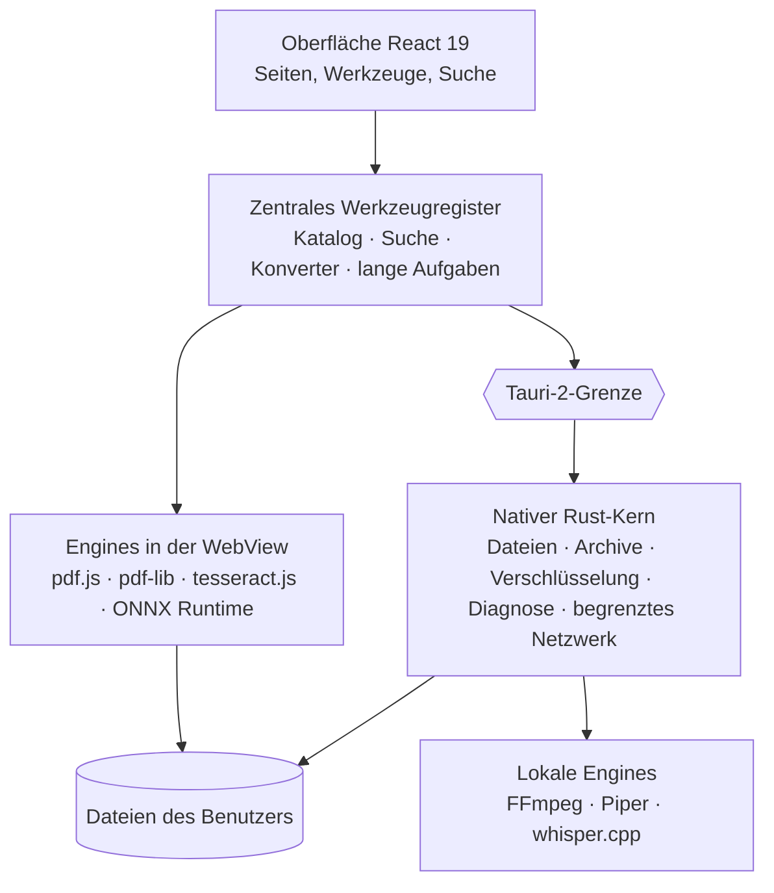

<div align="center">

[English](README.md) · [Français](README.fr.md) · [Español](README.es.md) · [Português (Brasil)](README.pt-BR.md) · **Deutsch** · [Italiano](README.it.md) · [简体中文](README.zh-CN.md) · [日本語](README.ja.md) · [한국어](README.ko.md) · [Русский](README.ru.md)


### 196 Werkzeuge. 12 Kategorien. Eine lokale Desktop-App.

Ein Desktop-Werkzeugkasten für PDF, Bilder, Audio, Video, Dokumente, Dateien,
Entwicklerwerkzeuge und Datenschutz — 196 Werkzeuge in einer einzigen
Anwendung, und Ihre Dateien verlassen Ihren Rechner nicht.

[](docs/guides/INSTALLATION.md#windows-10-and-11)
[](docs/guides/INSTALLATION.md#other-linux-distributions)
[](docs/technical/ARCHITECTURE.md)
[](docs/technical/ARCHITECTURE.md)
[](docs/technical/ARCHITECTURE.md)
[](docs/legal/PRIVACY.md)
[][releases]

**[Herunterladen][releases]** · **[Dokumentation](docs/README.md)** ·
**[Alle Werkzeuge](docs/guides/FEATURES.md)** · **[Datenschutz](docs/legal/PRIVACY.md)**

</div>

<br>

<div align="center">

<sub>Suche in natürlicher Sprache, Katalog, PDFs zusammenfügen, Bildanpassungen in Echtzeit, JSON — die echte Oberfläche, unverändert aufgenommen und beschleunigt (×1,3).</sub>
</div>

## Was FourTout kann

<table>
<tr>
<td width="33%" valign="top">

**PDF & Dokumente**<br>
Zusammenfügen, teilen, komprimieren, schwärzen, OCR für Scans, durchsuchbare
PDFs, Tabellen extrahieren, Word in PDF.

</td>
<td width="33%" valign="top">

**Bilder**<br>
Konvertieren, komprimieren, zuschneiden, **Hintergrund entfernen**, Text
extrahieren, EXIF löschen, Favicon erzeugen.

</td>
<td width="33%" valign="top">

**Audio & Video**<br>
Konvertieren, komprimieren, schneiden, normalisieren, transkribieren,
Sprachausgabe, Untertitel, Video ↔ GIF.

</td>
</tr>
<tr>
<td valign="top">

**Dateien & Archive**<br>
ZIP, 7z, TAR, AES-256-verschlüsselte Archive, Prüfsummen, Duplikate,
Massenumbenennung, Ordnersicherung.

</td>
<td valign="top">

**Entwickler**<br>
JSON, YAML, TOML, XML, SQL, verifiziertes JWT, Regex, Cron, QR-Codes,
schreibgeschützter SQLite-Explorer.

</td>
<td valign="top">

**Diagnose & Sicherheit**<br>
Beschädigte Dateien und Archive, Festplattenzustand, Dateiverschlüsselung,
Passwörter, Metadaten.

</td>
</tr>
</table>

Die vollständige Tabelle der zwölf Kategorien steht [weiter unten](#funktionen);
die Liste Werkzeug für Werkzeug steht in **[docs/guides/FEATURES.md](docs/guides/FEATURES.md)**.

## Sprachen

Die Oberfläche spricht **16 Sprachen**, alle in die Anwendung eingebaut:
English, Français, Español, Deutsch, Italiano, Português (Brasil), Nederlands,
Polski, Русский, Türkçe, Bahasa Indonesia, हिन्दी, 日本語, 한국어, 简体中文 und
繁體中文. Standardmäßig folgt FourTout der Systemsprache; umstellen lässt sie
sich unter **Einstellungen → Sprache**, und zwar sofort — es wird nichts
heruntergeladen.

Die Suche versteht sie alle: „pdf komprimieren“, „compress a pdf“,
„compresser un pdf“, „comprimir un pdf“, „сжать pdf“, „pdf を圧縮“ oder
„压缩 pdf“ führen zum selben Werkzeug, und Formatnamen (PDF, PNG, MP4, JSON,
SHA-256…) funktionieren in jeder Sprache.

## Vorschau

Aufnahmen der echten Anwendung (helles oder dunkles Design je nach Ihrer
GitHub-Einstellung), erstellt mit Beispieldateien. Sie zeigen die französische
Oberfläche.

<table>
<tr>
<td width="50%">
<picture>
  <source media="(prefers-color-scheme: dark)" srcset="docs/assets/screenshots/accueil-dark.webp">
  
</picture>
<p align="center"><sub><b>Start</b> — Favoriten, zuletzt verwendet, Kategorien</sub></p>
</td>
<td width="50%">
<picture>
  <source media="(prefers-color-scheme: dark)" srcset="docs/assets/screenshots/recherche-dark.webp">
  
</picture>
<p align="center"><sub><b>Suche</b> — beschreiben Sie den Bedarf, nicht den Werkzeugnamen</sub></p>
</td>
</tr>
<tr>
<td>
<picture>
  <source media="(prefers-color-scheme: dark)" srcset="docs/assets/screenshots/pdf-dark.webp">
  
</picture>
<p align="center"><sub><b>PDF</b> — Zusammenfügen in der gewählten Reihenfolge</sub></p>
</td>
<td>
<picture>
  <source media="(prefers-color-scheme: dark)" srcset="docs/assets/screenshots/images-dark.webp">
  
</picture>
<p align="center"><sub><b>Bilder</b> — Anpassungen mit Vorschau in Echtzeit</sub></p>
</td>
</tr>
<tr>
<td>
<picture>
  <source media="(prefers-color-scheme: dark)" srcset="docs/assets/screenshots/fichiers-dark.webp">
  
</picture>
<p align="center"><sub><b>Dateien</b> — SHA-256- und SHA-512-Prüfsummen, in Rust berechnet</sub></p>
</td>
<td>
<picture>
  <source media="(prefers-color-scheme: dark)" srcset="docs/assets/screenshots/media-dark.webp">
  
</picture>
<p align="center"><sub><b>Medien</b> — was die Datei wirklich enthält, gelesen von FFmpeg</sub></p>
</td>
</tr>
<tr>
<td>
<picture>
  <source media="(prefers-color-scheme: dark)" srcset="docs/assets/screenshots/developpeur-dark.webp">
  
</picture>
<p align="center"><sub><b>Entwickler</b> — JSON formatiert und validiert</sub></p>
</td>
<td>
<picture>
  <source media="(prefers-color-scheme: dark)" srcset="docs/assets/screenshots/diagnostic-dark.webp">
  
</picture>
<p align="center"><sub><b>Diagnose</b> — was an einem beschädigten Archiv kaputt ist</sub></p>
</td>
</tr>
</table>

## Warum

Ein PDF komprimieren, ein Bild in WebP umwandeln, den Ton aus einem Video
holen, JSON formatieren, Kilometer in Meilen umrechnen, ein Foto freistellen:
Jede dieser Aufgaben dauert dreißig Sekunden. Das passende Werkzeug zu finden
dauert länger, und die kostenlose Website, die es anbietet, will die Datei
oft hochgeladen haben.

FourTout geht vom Gegenteil aus: **Was sich auf Ihrem Rechner erledigen lässt,
wird dort erledigt.**

Drei Grundsätze tragen das Produkt:

1. **Was im Katalog steht, funktioniert.** Es gibt keine Werkzeuge mit
   „demnächst verfügbar“: Ein unfertiges Werkzeug wird gar nicht erst
   registriert.
2. **Keine Versprechen, die sich nicht prüfen lassen.** Hat ein Werkzeug eine
   Grenze — ein Löschen, das nicht physisch ist, eine Word-Umwandlung, die
   nicht pixelgenau ist, ein JWT, das dekodiert, aber nicht verifiziert ist —,
   sagt die Oberfläche das, genau dort, wo man es braucht.
3. **Nichts wird erfunden.** Die Suche schlägt nur Werkzeuge vor, die es
   wirklich gibt, und der Währungsrechner zeigt das Datum seiner Kurse statt
   eines Kurses unbekannter Herkunft.

## Funktionen

| Kategorie | Werkzeuge | Beispiele |
| --- | ---: | --- |
| **PDF** | 26 | Zusammenfügen, teilen, komprimieren, schwärzen, OCR, vergessenes Passwort wiederherstellen |
| **Bilder** | 25 | Konvertieren, komprimieren, zuschneiden, Wasserzeichen, OCR, **Hintergrund entfernen**, EXIF löschen |
| **Audio** | 18 | Konvertieren, normalisieren, Stille entfernen, Sprachausgabe, Transkription |
| **Video** | 20 | Konvertieren, komprimieren, zuschneiden, untertiteln, einbrennen, Video ↔ GIF |
| **Text & Dokumente** | 20 | Bereinigen, vergleichen, Markdown ↔ HTML, DOCX lesen und umwandeln |
| **Dateien & Archive** | 29 | Archive, Prüfsummen, Duplikate, Stapelumbenennung, Sicherung, Hex-Editor |
| **Konverter** | 1 | Datei ablegen: FourTout schlägt die möglichen Umwandlungen vor |
| **Entwickler** | 21 | JSON, XML, YAML, TOML, SQL, Base32, **verifiziertes** JWT, **SQLite-Datenbank**, Regex, Cron |
| **Rechner** | 21 | Einheiten, Prozente, Daten, **Zeitzonen**, **Bandbreite**, **Zinsen**, Währungen |
| **Netzwerk** | 3 | Ping, Porttest, Erkennung im lokalen Netzwerk — begrenzt und nie darüber hinaus |
| **Diagnose & Wiederherstellung** | 5 | Beschädigte Datei, unlesbares Archiv, kaputtes PDF, beschädigtes Bild, Datenträger und Partitionen |
| **Sicherheit** | 7 | Passwörter, Dateiverschlüsselung, HMAC, Entfernen von Metadaten |

Jedes Werkzeug wird in seiner eigenen Kategorie gezählt: insgesamt 196. Ein
Werkzeug kann auch in anderen Kategorien angeboten werden, dort, wo man es
sucht — deshalb zeigt die Anwendung pro Kategorie höhere Zahlen.

Die vollständige Liste, Werkzeug für Werkzeug: **[docs/guides/FEATURES.md](docs/guides/FEATURES.md)**.

## Datenschutz

Die gesamte Dateiverarbeitung ist lokal: PDF, Bilder, Audio, Video, Text,
Archive, Prüfsummen, Verschlüsselung, Freistellen. Keine Datei wird
hochgeladen. Kein Konto, keine Analyse, keine Telemetrie, keine automatischen
Updates.

Zwei Funktionen sind Ausnahmen, und beide sagen das in der Oberfläche:

- der **Währungsrechner** fragt den täglichen Referenzkurs-Feed der
  Europäischen Zentralbank ab. Der umzurechnende Betrag verlässt den Rechner
  nie; offline werden die zuletzt bekannten Kurse wiederverwendet **und mit
  Datum angezeigt**;
- die **Modelle** für Sprachausgabe, Transkription und Freistellen werden auf
  Ihre ausdrückliche Anforderung einmalig heruntergeladen. Danach läuft alles
  auf dem Rechner.

Die drei **Netzwerk**-Werkzeuge (Ping, Ports, Erkennung im lokalen Netzwerk)
öffnen echte Verbindungen, aber nur zu den Hosts, die Sie angeben, oder in Ihr
lokales Subnetz, und nie ohne einen Klick.

Im Detail, Funktion für Funktion: **[docs/legal/PRIVACY.md](docs/legal/PRIVACY.md)**.

## Installation

Laden Sie das Paket für Ihr System von der Seite **[Releases][releases]** herunter.

| System | Datei |
| --- | --- |
| Windows 10 / 11 | `FourTout-<version>-Windows-x64-Setup.exe` |
| Fedora, RHEL | `FourTout-<version>-Fedora-x86_64.rpm` |
| Debian, Ubuntu | `FourTout-<version>-Linux-amd64.deb` |
| Andere Linux-Distributionen | `FourTout-<version>-Linux-x86_64.AppImage` |

> **Verwenden Sie nicht „Code → Download ZIP“.** Dieses Archiv enthält den
> Quellcode, nicht die Anwendung. Die installierbaren Dateien liegen auf der
> Seite Releases.

Ausführliche Anleitung, Voraussetzungen und Prüfsummenkontrolle:
**[docs/guides/INSTALLATION.md](docs/guides/INSTALLATION.md)**.

> Die Windows-Installer sind noch nicht signiert: SmartScreen zeigt beim ersten
> Start eine Warnung. Das ist zu erwarten und in der Installationsanleitung
> erklärt.

## Architektur



| Schicht | Technologie |
| --- | --- |
| Oberfläche | React 19, TypeScript, Tailwind CSS 4, Vite 7 |
| Desktop-Anwendung | Tauri 2 (WebKitGTK unter Linux, WebView2 unter Windows) |
| Native Verarbeitung | Rust — Dateien, Archive, Verschlüsselung, Prüfsummen, Sidecars |
| PDF | pdf.js (Lesen, Rendern), @cantoo/pdf-lib (Schreiben) |
| Medien | FFmpeg (System oder mitgeliefert), Codecs zur Laufzeit geprüft |
| OCR | tesseract.js, vollständig lokal |
| Freistellen | U²-Net über ONNX Runtime, vollständig lokal |
| Sprache | Piper (Synthese), whisper.cpp (Transkription) |
| Sprachen | 16 eingebaute Sprachen, Nachrichten im ICU-Stil, Formatierung über `Intl` |

Alle Werkzeuge leiten sich aus einem **zentralen Register** ab: Katalog,
Navigation, Suche, Universalkonverter und Drag-and-drop-Zuordnung lesen
dieselbe Quelle. Die Übersetzungen liegen daneben, nach Werkzeugkennung
sortiert: Ein Werkzeug wird nie pro Sprache dupliziert. Details:
**[docs/technical/ARCHITECTURE.md](docs/technical/ARCHITECTURE.md)** und
**[docs/technical/I18N.md](docs/technical/I18N.md)**.

## Entwicklung

```bash
pnpm install       # Node-Abhängigkeiten
pnpm app:dev       # startet die Desktop-Anwendung (Tauri + Vite)
pnpm verify        # Lint + Typecheck + Tests + Build
pnpm i18n:status   # Übersetzungsstand, Sprache für Sprache
```

Voraussetzungen, Konventionen und Fallstricke der Umgebung:
**[docs/technical/DEVELOPMENT.md](docs/technical/DEVELOPMENT.md)**.
Pakete bauen: **[docs/technical/BUILD.md](docs/technical/BUILD.md)**.
Screenshots, Banner und Demo neu erzeugen:
**[scripts/showcase/README.md](scripts/showcase/README.md)**.

## Sicherheit

Die Dateiverschlüsselung nutzt **Argon2id** zur Schlüsselableitung und
**XChaCha20-Poly1305** zur Verschlüsselung, in authentifizierten Blöcken.
Geschützte Archive verwenden **WinZip AES-256**, lesbar mit 7-Zip, WinRAR und
dem Windows-Explorer.

Bedrohungsmodell, Format der verschlüsselten Dateien, Grenzen des sicheren
Löschens und Meldung einer Schwachstelle:
**[docs/legal/SECURITY.md](docs/legal/SECURITY.md)**.

## Dokumentation

Das vollständige englische Verzeichnis steht in **[docs/README.md](docs/README.md)**;
eine vollständige französische Fassung liegt unter **[docs/fr/](docs/fr/README.md)**.

## Lizenz

**FourTout ist proprietäre Software.**
Copyright © 2026 Matheo Dolmen. Alle Rechte vorbehalten.

Der Quellcode wird auf GitHub veröffentlicht, damit er gelesen, geprüft und
diskutiert werden kann: Seine Veröffentlichung gewährt keine Lizenz zur
Wiederverwendung oder Weiterverbreitung. Jede wesentliche Kopie,
Weiterverbreitung, veröffentlichte geänderte Fassung oder kommerzielle Nutzung
bedarf einer vorherigen schriftlichen Genehmigung.

Siehe **[LICENSE](LICENSE)**.

## Komponenten Dritter

FourTout baut auf freier Software auf, die unter **ihren eigenen Lizenzen**
bleibt — die Lizenz von FourTout ersetzt sie nicht. Vollständige Aufstellung:
**[THIRD_PARTY_NOTICES.md](THIRD_PARTY_NOTICES.md)**.

[releases]: https://github.com/lolmath06/FourTout/releases
