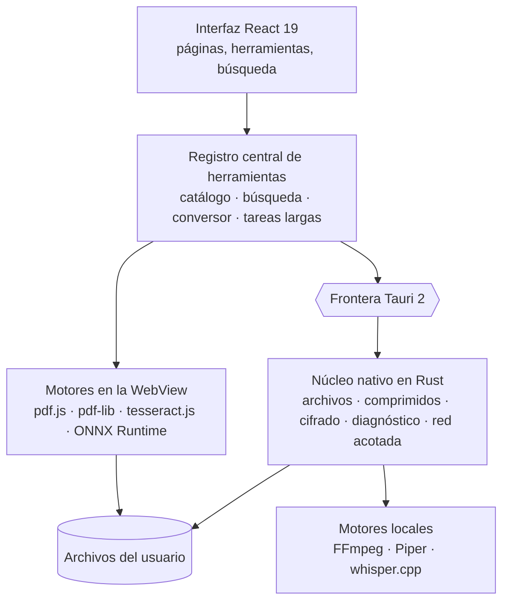

<div align="center">

[English](README.md) · [Français](README.fr.md) · **Español** · [Português (Brasil)](README.pt-BR.md) · [Deutsch](README.de.md) · [Italiano](README.it.md) · [简体中文](README.zh-CN.md) · [日本語](README.ja.md) · [한국어](README.ko.md) · [Русский](README.ru.md)


### 196 herramientas. 12 categorías. Una sola aplicación de escritorio local.

Una caja de herramientas de escritorio que reúne PDF, imágenes, audio, vídeo,
documentos, archivos, herramientas para desarrolladores y privacidad: 196
herramientas en una sola aplicación, y sus archivos nunca salen de su equipo.

[](docs/guides/INSTALLATION.md#windows-10-and-11)
[](docs/guides/INSTALLATION.md#other-linux-distributions)
[](docs/technical/ARCHITECTURE.md)
[](docs/technical/ARCHITECTURE.md)
[](docs/technical/ARCHITECTURE.md)
[](docs/legal/PRIVACY.md)
[][releases]

**[Descargar][releases]** · **[Documentación](docs/README.md)** ·
**[Todas las herramientas](docs/guides/FEATURES.md)** · **[Privacidad](docs/legal/PRIVACY.md)**

</div>

<br>

<div align="center">

<sub>Búsqueda en lenguaje natural, catálogo, unión de PDF, ajustes de imagen en tiempo real, JSON: la interfaz real, grabada tal cual y acelerada (×1,3).</sub>
</div>

## Qué hace FourTout

<table>
<tr>
<td width="33%" valign="top">

**PDF y documentos**<br>
Unir, dividir, comprimir, censurar, OCR de un escaneo, PDF con búsqueda,
extracción de tablas, Word a PDF.

</td>
<td width="33%" valign="top">

**Imágenes**<br>
Convertir, comprimir, recortar, **quitar el fondo**, extraer texto,
borrar el EXIF, generar un favicon.

</td>
<td width="33%" valign="top">

**Audio y vídeo**<br>
Convertir, comprimir, recortar, normalizar, transcribir, texto a voz,
subtítulos, vídeo ↔ GIF.

</td>
</tr>
<tr>
<td valign="top">

**Archivos y comprimidos**<br>
ZIP, 7z, TAR, archivos cifrados AES-256, hashes, duplicados, renombrado
masivo, copias de seguridad de carpetas.

</td>
<td valign="top">

**Desarrollo**<br>
JSON, YAML, TOML, XML, SQL, JWT verificado, regex, cron, códigos QR,
explorador SQLite de solo lectura.

</td>
<td valign="top">

**Diagnóstico y seguridad**<br>
Archivos y comprimidos dañados, salud de los discos, cifrado de archivos,
contraseñas, metadatos.

</td>
</tr>
</table>

La tabla completa de las doce categorías está [más abajo](#funciones); la
lista herramienta por herramienta está en **[docs/guides/FEATURES.md](docs/guides/FEATURES.md)**.

## Idiomas

La interfaz habla **16 idiomas**, todos integrados en la aplicación:
English, Français, Español, Deutsch, Italiano, Português (Brasil), Nederlands,
Polski, Русский, Türkçe, Bahasa Indonesia, हिन्दी, 日本語, 한국어, 简体中文 y
繁體中文. De forma predeterminada, FourTout sigue el idioma del sistema; puede
cambiarlo en **Ajustes → Idioma** y el cambio es inmediato: no se descarga nada.

La búsqueda los entiende todos: «comprimir un pdf», «compress a pdf»,
«compresser un pdf», «pdf komprimieren», «сжать pdf», «pdf を圧縮» o
«压缩 pdf» llevan a la misma herramienta, y los nombres de formato (PDF, PNG,
MP4, JSON, SHA-256…) funcionan en cualquier idioma.

## Vista previa

Capturas de la aplicación real (tema claro u oscuro según su ajuste de
GitHub), hechas con archivos ficticios. Muestran la interfaz en francés.

<table>
<tr>
<td width="50%">
<picture>
  <source media="(prefers-color-scheme: dark)" srcset="docs/assets/screenshots/accueil-dark.webp">
  
</picture>
<p align="center"><sub><b>Inicio</b> — favoritos, recientes, categorías</sub></p>
</td>
<td width="50%">
<picture>
  <source media="(prefers-color-scheme: dark)" srcset="docs/assets/screenshots/recherche-dark.webp">
  
</picture>
<p align="center"><sub><b>Búsqueda</b> — describa la necesidad, no el nombre de la herramienta</sub></p>
</td>
</tr>
<tr>
<td>
<picture>
  <source media="(prefers-color-scheme: dark)" srcset="docs/assets/screenshots/pdf-dark.webp">
  
</picture>
<p align="center"><sub><b>PDF</b> — unión, en el orden elegido</sub></p>
</td>
<td>
<picture>
  <source media="(prefers-color-scheme: dark)" srcset="docs/assets/screenshots/images-dark.webp">
  
</picture>
<p align="center"><sub><b>Imágenes</b> — ajustes con vista previa en tiempo real</sub></p>
</td>
</tr>
<tr>
<td>
<picture>
  <source media="(prefers-color-scheme: dark)" srcset="docs/assets/screenshots/fichiers-dark.webp">
  
</picture>
<p align="center"><sub><b>Archivos</b> — hashes SHA-256 y SHA-512, calculados en Rust</sub></p>
</td>
<td>
<picture>
  <source media="(prefers-color-scheme: dark)" srcset="docs/assets/screenshots/media-dark.webp">
  
</picture>
<p align="center"><sub><b>Multimedia</b> — lo que el archivo contiene de verdad, leído por FFmpeg</sub></p>
</td>
</tr>
<tr>
<td>
<picture>
  <source media="(prefers-color-scheme: dark)" srcset="docs/assets/screenshots/developpeur-dark.webp">
  
</picture>
<p align="center"><sub><b>Desarrollo</b> — JSON formateado y validado</sub></p>
</td>
<td>
<picture>
  <source media="(prefers-color-scheme: dark)" srcset="docs/assets/screenshots/diagnostic-dark.webp">
  
</picture>
<p align="center"><sub><b>Diagnóstico</b> — qué está roto en un comprimido dañado</sub></p>
</td>
</tr>
</table>

## Por qué

Comprimir un PDF, convertir una imagen a WebP, extraer el sonido de un vídeo,
formatear JSON, pasar kilómetros a millas, recortar una foto: cada una de estas
tareas lleva treinta segundos. Encontrar la herramienta lleva más, y la web
gratuita que la ofrece suele pedir que se suba el archivo.

FourTout parte de la idea contraria: **si la operación puede hacerse en su
equipo, se hace ahí.**

Tres principios sostienen el producto:

1. **Lo que está en el catálogo funciona.** No hay herramientas «próximamente»:
   una herramienta incompleta no se registra.
2. **Ninguna promesa imposible de comprobar.** Cuando una herramienta tiene un
   límite —un borrado que no es físico, una conversión de Word que no es fiel
   al píxel, un JWT decodificado pero no verificado— la interfaz lo dice, justo
   donde el usuario lo necesita.
3. **No se inventa nada.** La búsqueda solo propone herramientas que existen de
   verdad, y el conversor de divisas muestra la fecha de sus tipos en lugar de
   un tipo de origen desconocido.

## Funciones

| Categoría | Herramientas | Ejemplos |
| --- | ---: | --- |
| **PDF** | 26 | Unir, dividir, comprimir, censurar, OCR, recuperar una contraseña olvidada |
| **Imágenes** | 25 | Convertir, comprimir, recortar, marca de agua, OCR, **quitar el fondo**, borrar el EXIF |
| **Audio** | 18 | Convertir, normalizar, cortar silencios, texto a voz, transcripción |
| **Vídeo** | 20 | Convertir, comprimir, recortar, subtitular, incrustar, vídeo ↔ GIF |
| **Texto y documentos** | 20 | Limpiar, comparar, Markdown ↔ HTML, leer y convertir un DOCX |
| **Archivos y comprimidos** | 29 | Comprimidos, hashes, duplicados, renombrado por lotes, copias de seguridad, editor hexadecimal |
| **Conversores** | 1 | Suelte un archivo: FourTout propone las conversiones posibles |
| **Desarrollo** | 21 | JSON, XML, YAML, TOML, SQL, Base32, JWT **verificado**, **base SQLite**, regex, cron |
| **Calculadoras** | 21 | Unidades, porcentajes, fechas, **zonas horarias**, **ancho de banda**, **intereses**, divisas |
| **Red** | 3 | Ping, prueba de puertos, descubrimiento de la red local: acotados, y nunca más allá |
| **Diagnóstico y recuperación** | 5 | Archivo corrupto, comprimido ilegible, PDF roto, imagen dañada, discos y particiones |
| **Seguridad** | 7 | Contraseñas, cifrado de archivos, HMAC, eliminación de metadatos |

Cada herramienta se cuenta en la categoría a la que pertenece: 196 en total.
Una herramienta también puede ofrecerse en otras categorías, donde se la busca;
por eso la aplicación muestra cifras más altas por categoría.

La lista completa, herramienta por herramienta: **[docs/guides/FEATURES.md](docs/guides/FEATURES.md)**.

## Privacidad

Todo el procesamiento de archivos es local: PDF, imágenes, audio, vídeo, texto,
comprimidos, hashes, cifrado, recorte de fondo. Ningún archivo se sube. Ni
cuenta, ni analítica, ni telemetría, ni actualizaciones automáticas.

Dos funciones son la excepción, y ambas lo dicen en la interfaz:

- el **conversor de divisas** consulta el flujo de referencia diario del Banco
  Central Europeo. El importe que se convierte nunca sale del equipo; sin
  conexión, se reutilizan los últimos tipos conocidos **con su fecha**;
- los **modelos** de síntesis de voz, transcripción y recorte de fondo se
  descargan una sola vez, cuando usted lo pide expresamente. Después, todo se
  ejecuta en el equipo.

Las tres herramientas de **red** (ping, puertos, descubrimiento de la red local)
abren conexiones reales, pero solo hacia los hosts que usted indica o hacia su
subred local, y nunca sin un clic.

El detalle, función por función: **[docs/legal/PRIVACY.md](docs/legal/PRIVACY.md)**.

## Instalación

Descargue el paquete de su sistema desde la página **[Releases][releases]**.

| Sistema | Archivo |
| --- | --- |
| Windows 10 / 11 | `FourTout-<version>-Windows-x64-Setup.exe` |
| Fedora, RHEL | `FourTout-<version>-Fedora-x86_64.rpm` |
| Debian, Ubuntu | `FourTout-<version>-Linux-amd64.deb` |
| Otros Linux | `FourTout-<version>-Linux-x86_64.AppImage` |

> **No use «Code → Download ZIP».** Ese archivo contiene el código fuente, no
> la aplicación. Los archivos instalables están en la página Releases.

Instrucciones detalladas, requisitos y verificación de hashes:
**[docs/guides/INSTALLATION.md](docs/guides/INSTALLATION.md)**.

> Los instaladores de Windows todavía no están firmados: SmartScreen mostrará
> una advertencia en el primer inicio. Es lo esperado, y se explica en la guía
> de instalación.

## Arquitectura



| Capa | Tecnología |
| --- | --- |
| Interfaz | React 19, TypeScript, Tailwind CSS 4, Vite 7 |
| Aplicación de escritorio | Tauri 2 (WebKitGTK en Linux, WebView2 en Windows) |
| Procesamiento nativo | Rust: archivos, comprimidos, cifrado, hashes, sidecars |
| PDF | pdf.js (lectura, renderizado), @cantoo/pdf-lib (escritura) |
| Multimedia | FFmpeg (del sistema o incluido), códecs comprobados en ejecución |
| OCR | tesseract.js, totalmente local |
| Recorte de fondo | U²-Net mediante ONNX Runtime, totalmente local |
| Voz | Piper (síntesis), whisper.cpp (transcripción) |
| Idiomas | 16 idiomas integrados, mensajes de estilo ICU, formato `Intl` |

Todas las herramientas derivan de un **registro central**: catálogo,
navegación, búsqueda, conversor universal y enrutado por arrastrar y soltar
leen la misma fuente. Las traducciones viven al lado, indexadas por
identificador de herramienta: una herramienta nunca se duplica por idioma.
Detalles: **[docs/technical/ARCHITECTURE.md](docs/technical/ARCHITECTURE.md)** y
**[docs/technical/I18N.md](docs/technical/I18N.md)**.

## Desarrollo

```bash
pnpm install       # dependencias de Node
pnpm app:dev       # inicia la aplicación de escritorio (Tauri + Vite)
pnpm verify        # lint + typecheck + tests + build
pnpm i18n:status   # cobertura de las traducciones, idioma por idioma
```

Requisitos, convenciones y trampas del entorno:
**[docs/technical/DEVELOPMENT.md](docs/technical/DEVELOPMENT.md)**.
Construir los paquetes: **[docs/technical/BUILD.md](docs/technical/BUILD.md)**.
Regenerar las capturas, el banner y la demostración:
**[scripts/showcase/README.md](scripts/showcase/README.md)**.

## Seguridad

El cifrado de archivos usa **Argon2id** para derivar la clave y
**XChaCha20-Poly1305** para cifrar, por bloques autenticados. Los archivos
comprimidos protegidos usan **WinZip AES-256**, legible por 7-Zip, WinRAR y el
Explorador de Windows.

Modelo de amenazas, formato de archivo cifrado, límites del borrado seguro y
cómo informar de una vulnerabilidad:
**[docs/legal/SECURITY.md](docs/legal/SECURITY.md)**.

## Documentación

El índice completo en inglés está en **[docs/README.md](docs/README.md)**, con
un espejo completo en francés en **[docs/fr/](docs/fr/README.md)**.

## Licencia

**FourTout es software propietario.**
Copyright © 2026 Matheo Dolmen. Todos los derechos reservados.

El código fuente se publica en GitHub para ser leído, auditado y debatido: su
publicación no concede ninguna licencia de reutilización ni de redistribución.
Cualquier copia sustancial, redistribución, versión modificada publicada o uso
comercial requiere una autorización previa por escrito.

Consulte **[LICENSE](LICENSE)**.

## Componentes de terceros

FourTout se apoya en software libre, que sigue sujeto a **sus propias
licencias**: la licencia de FourTout no las sustituye. Inventario completo:
**[THIRD_PARTY_NOTICES.md](THIRD_PARTY_NOTICES.md)**.

[releases]: https://github.com/lolmath06/FourTout/releases
