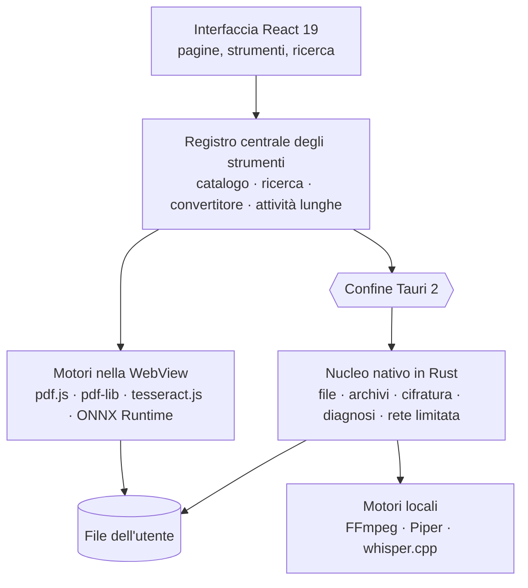

<div align="center">

[English](README.md) · [Français](README.fr.md) · [Español](README.es.md) · [Português (Brasil)](README.pt-BR.md) · [Deutsch](README.de.md) · **Italiano** · [简体中文](README.zh-CN.md) · [日本語](README.ja.md) · [한국어](README.ko.md) · [Русский](README.ru.md)


### 196 strumenti. 12 categorie. Un'unica app desktop locale.

Una cassetta degli attrezzi desktop che riunisce PDF, immagini, audio, video,
documenti, file, strumenti per sviluppatori e privacy: 196 strumenti in
un'unica applicazione, e i tuoi file non lasciano mai il tuo computer.

[](docs/guides/INSTALLATION.md#windows-10-et-11)
[](docs/guides/INSTALLATION.md#autres-distributions-linux)
[](docs/technical/ARCHITECTURE.md)
[](docs/technical/ARCHITECTURE.md)
[](docs/technical/ARCHITECTURE.md)
[](docs/legal/PRIVACY.md)
[][releases]

**[Scarica][releases]** · **[Documentazione](docs/README.md)** ·
**[Tutti gli strumenti](docs/guides/FEATURES.md)** · **[Privacy](docs/legal/PRIVACY.md)**

</div>

<br>

<div align="center">

<sub>Ricerca in linguaggio naturale, catalogo, unione di PDF, regolazioni dell'immagine in tempo reale, JSON: l'interfaccia reale, registrata così com'è e accelerata (×1,3).</sub>
</div>

## Cosa fa FourTout

<table>
<tr>
<td width="33%" valign="top">

**PDF e documenti**<br>
Unire, dividere, comprimere, oscurare, OCR di una scansione, PDF
ricercabile, estrazione di tabelle, Word in PDF.

</td>
<td width="33%" valign="top">

**Immagini**<br>
Convertire, comprimere, ritagliare, **rimuovere lo sfondo**, estrarre il
testo, cancellare l'EXIF, generare una favicon.

</td>
<td width="33%" valign="top">

**Audio e video**<br>
Convertire, comprimere, tagliare, normalizzare, trascrivere, sintesi
vocale, sottotitoli, video ↔ GIF.

</td>
</tr>
<tr>
<td valign="top">

**File e archivi**<br>
ZIP, 7z, TAR, archivi cifrati AES-256, impronte, duplicati, rinomina in
blocco, backup di cartelle.

</td>
<td valign="top">

**Sviluppatori**<br>
JSON, YAML, TOML, XML, SQL, JWT verificato, regex, cron, codici QR,
esploratore SQLite in sola lettura.

</td>
<td valign="top">

**Diagnosi e sicurezza**<br>
File e archivi danneggiati, salute dei dischi, cifratura dei file,
password, metadati.

</td>
</tr>
</table>

La tabella completa delle dodici categorie è [più sotto](#funzionalità); la
lista strumento per strumento è in **[docs/guides/FEATURES.md](docs/guides/FEATURES.md)**.

## Lingue

L'interfaccia parla **16 lingue**, tutte integrate nell'applicazione:
English, Français, Español, Deutsch, Italiano, Português (Brasil), Nederlands,
Polski, Русский, Türkçe, Bahasa Indonesia, हिन्दी, 日本語, 한국어, 简体中文 e
繁體中文. Per impostazione predefinita FourTout segue la lingua del sistema;
puoi cambiarla in **Impostazioni → Lingua** e il cambio è immediato: non viene
scaricato nulla.

La ricerca le capisce tutte: «comprimere pdf», «compress a pdf»,
«compresser un pdf», «comprimir un pdf», «pdf komprimieren», «сжать pdf»,
«pdf を圧縮» o «压缩 pdf» portano allo stesso strumento, e i nomi dei formati
(PDF, PNG, MP4, JSON, SHA-256…) funzionano in qualsiasi lingua.

## Anteprima

Schermate dell'applicazione reale (tema chiaro o scuro secondo la tua
impostazione di GitHub), realizzate con file di prova. Mostrano l'interfaccia
in francese.

<table>
<tr>
<td width="50%">
<picture>
  <source media="(prefers-color-scheme: dark)" srcset="docs/assets/screenshots/accueil-dark.webp">
  
</picture>
<p align="center"><sub><b>Home</b> — preferiti, recenti, categorie</sub></p>
</td>
<td width="50%">
<picture>
  <source media="(prefers-color-scheme: dark)" srcset="docs/assets/screenshots/recherche-dark.webp">
  
</picture>
<p align="center"><sub><b>Ricerca</b> — descrivi l'esigenza, non il nome dello strumento</sub></p>
</td>
</tr>
<tr>
<td>
<picture>
  <source media="(prefers-color-scheme: dark)" srcset="docs/assets/screenshots/pdf-dark.webp">
  
</picture>
<p align="center"><sub><b>PDF</b> — unione, nell'ordine scelto</sub></p>
</td>
<td>
<picture>
  <source media="(prefers-color-scheme: dark)" srcset="docs/assets/screenshots/images-dark.webp">
  
</picture>
<p align="center"><sub><b>Immagini</b> — regolazioni con anteprima in tempo reale</sub></p>
</td>
</tr>
<tr>
<td>
<picture>
  <source media="(prefers-color-scheme: dark)" srcset="docs/assets/screenshots/fichiers-dark.webp">
  
</picture>
<p align="center"><sub><b>File</b> — impronte SHA-256 e SHA-512, calcolate in Rust</sub></p>
</td>
<td>
<picture>
  <source media="(prefers-color-scheme: dark)" srcset="docs/assets/screenshots/media-dark.webp">
  
</picture>
<p align="center"><sub><b>Multimedia</b> — cosa contiene davvero il file, letto da FFmpeg</sub></p>
</td>
</tr>
<tr>
<td>
<picture>
  <source media="(prefers-color-scheme: dark)" srcset="docs/assets/screenshots/developpeur-dark.webp">
  
</picture>
<p align="center"><sub><b>Sviluppatori</b> — JSON formattato e validato</sub></p>
</td>
<td>
<picture>
  <source media="(prefers-color-scheme: dark)" srcset="docs/assets/screenshots/diagnostic-dark.webp">
  
</picture>
<p align="center"><sub><b>Diagnosi</b> — cosa c'è di rotto in un archivio danneggiato</sub></p>
</td>
</tr>
</table>

## Perché

Comprimere un PDF, convertire un'immagine in WebP, estrarre l'audio da un
video, formattare un JSON, convertire chilometri in miglia, scontornare una
foto: ognuna di queste operazioni richiede trenta secondi. Trovare lo strumento
giusto richiede di più, e il sito gratuito che lo offre spesso chiede di
caricare il file.

FourTout parte dall'idea opposta: **se l'operazione si può fare sul tuo
computer, si fa lì.**

Tre principi reggono il prodotto:

1. **Ciò che è nel catalogo funziona.** Non esistono strumenti «in arrivo»: uno
   strumento incompleto non viene registrato.
2. **Nessuna promessa non verificabile.** Quando uno strumento ha un limite —
   una cancellazione che non è fisica, una conversione Word non fedele al
   pixel, un JWT decodificato ma non verificato — l'interfaccia lo dice, proprio
   dove serve.
3. **Non si inventa nulla.** La ricerca propone solo strumenti che esistono
   davvero, e il convertitore di valute mostra la data dei tassi anziché un
   tasso di origine sconosciuta.

## Funzionalità

| Categoria | Strumenti | Esempi |
| --- | ---: | --- |
| **PDF** | 26 | Unire, dividere, comprimere, oscurare, OCR, recuperare una password dimenticata |
| **Immagini** | 25 | Convertire, comprimere, ritagliare, filigrana, OCR, **rimuovere lo sfondo**, cancellare l'EXIF |
| **Audio** | 18 | Convertire, normalizzare, tagliare i silenzi, sintesi vocale, trascrizione |
| **Video** | 20 | Convertire, comprimere, ritagliare, sottotitolare, incorporare sottotitoli, video ↔ GIF |
| **Testo e documenti** | 20 | Ripulire, confrontare, Markdown ↔ HTML, leggere e convertire un DOCX |
| **File e archivi** | 29 | Archivi, impronte, duplicati, rinomina in blocco, backup, editor esadecimale |
| **Convertitori** | 1 | Trascina un file: FourTout propone le conversioni possibili |
| **Sviluppatori** | 21 | JSON, XML, YAML, TOML, SQL, Base32, JWT **verificato**, **database SQLite**, regex, cron |
| **Calcolatrici** | 21 | Unità, percentuali, date, **fusi orari**, **larghezza di banda**, **interessi**, valute |
| **Rete** | 3 | Ping, test delle porte, scoperta della rete locale: limitati, e mai oltre |
| **Diagnosi e recupero** | 5 | File corrotto, archivio illeggibile, PDF rotto, immagine danneggiata, dischi e partizioni |
| **Sicurezza** | 7 | Password, cifratura dei file, HMAC, rimozione dei metadati |

Ogni strumento è contato nella categoria a cui appartiene: 196 in totale. Uno
strumento può anche comparire in altre categorie, dove lo si cerca: per questo
l'applicazione mostra numeri più alti per categoria.

La lista completa, strumento per strumento: **[docs/guides/FEATURES.md](docs/guides/FEATURES.md)**.

## Privacy

Tutta l'elaborazione dei file è locale: PDF, immagini, audio, video, testo,
archivi, impronte, cifratura, scontorno. Nessun file viene caricato. Nessun
account, nessuna analisi, nessuna telemetria, nessun aggiornamento automatico.

Due funzioni fanno eccezione, ed entrambe lo dichiarano nell'interfaccia:

- il **convertitore di valute** interroga il flusso di riferimento giornaliero
  della Banca centrale europea. L'importo da convertire non lascia mai il
  computer; offline vengono riutilizzati gli ultimi tassi noti, **con la loro
  data**;
- i **modelli** di sintesi vocale, trascrizione e scontorno vengono scaricati
  una sola volta, su tua richiesta esplicita. Dopo, tutto viene eseguito sul
  computer.

I tre strumenti di **rete** (ping, porte, scoperta della rete locale) aprono
connessioni reali, ma solo verso gli host che indichi o verso la tua sottorete
locale, e mai senza un clic.

Il dettaglio, funzione per funzione: **[docs/legal/PRIVACY.md](docs/legal/PRIVACY.md)**.

## Installazione

Scarica il pacchetto per il tuo sistema dalla pagina **[Releases][releases]**.

| Sistema | File |
| --- | --- |
| Windows 10 / 11 | `FourTout-<version>-Windows-x64-Setup.exe` |
| Fedora, RHEL | `FourTout-<version>-Fedora-x86_64.rpm` |
| Debian, Ubuntu | `FourTout-<version>-Linux-amd64.deb` |
| Altri Linux | `FourTout-<version>-Linux-x86_64.AppImage` |

> **Non usare «Code → Download ZIP».** Quell'archivio contiene il codice
> sorgente, non l'applicazione. I file installabili sono nella pagina Releases.

Istruzioni dettagliate, prerequisiti e verifica delle impronte:
**[docs/guides/INSTALLATION.md](docs/guides/INSTALLATION.md)**.

> Gli installer per Windows non sono ancora firmati: SmartScreen mostrerà un
> avviso al primo avvio. È previsto, e spiegato nella guida di installazione.

## Architettura



| Livello | Tecnologia |
| --- | --- |
| Interfaccia | React 19, TypeScript, Tailwind CSS 4, Vite 7 |
| Applicazione desktop | Tauri 2 (WebKitGTK su Linux, WebView2 su Windows) |
| Elaborazione nativa | Rust: file, archivi, cifratura, impronte, sidecar |
| PDF | pdf.js (lettura, rendering), @cantoo/pdf-lib (scrittura) |
| Multimedia | FFmpeg (di sistema o incluso), codec verificati all'esecuzione |
| OCR | tesseract.js, interamente locale |
| Scontorno | U²-Net tramite ONNX Runtime, interamente locale |
| Voce | Piper (sintesi), whisper.cpp (trascrizione) |
| Lingue | 16 lingue integrate, messaggi in stile ICU, formattazione `Intl` |

Tutti gli strumenti derivano da un **registro centrale**: catalogo,
navigazione, ricerca, convertitore universale e instradamento tramite
trascinamento leggono la stessa fonte. Le traduzioni stanno accanto,
indicizzate per identificatore dello strumento: uno strumento non viene mai
duplicato per lingua. Dettagli:
**[docs/technical/ARCHITECTURE.md](docs/technical/ARCHITECTURE.md)** e
**[docs/technical/I18N.md](docs/technical/I18N.md)**.

## Sviluppo

```bash
pnpm install       # dipendenze Node
pnpm app:dev       # avvia l'applicazione desktop (Tauri + Vite)
pnpm verify        # lint + typecheck + test + build
pnpm i18n:status   # copertura delle traduzioni, lingua per lingua
```

Prerequisiti, convenzioni e insidie dell'ambiente:
**[docs/technical/DEVELOPMENT.md](docs/technical/DEVELOPMENT.md)**.
Creare i pacchetti: **[docs/technical/BUILD.md](docs/technical/BUILD.md)**.
Rigenerare schermate, banner e dimostrazione:
**[scripts/showcase/README.md](scripts/showcase/README.md)**.

## Sicurezza

La cifratura dei file usa **Argon2id** per derivare la chiave e
**XChaCha20-Poly1305** per cifrare, a blocchi autenticati. Gli archivi protetti
usano **WinZip AES-256**, leggibile da 7-Zip, WinRAR ed Esplora file di
Windows.

Modello delle minacce, formato dei file cifrati, limiti della cancellazione
sicura e segnalazione di una vulnerabilità:
**[docs/legal/SECURITY.md](docs/legal/SECURITY.md)**.

## Documentazione

L'indice completo: **[docs/README.md](docs/README.md)**. La documentazione è
scritta in francese.

## Licenza

**FourTout è un software proprietario.**
Copyright © 2026 Matheo Dolmen. Tutti i diritti riservati.

Il codice sorgente è pubblicato su GitHub per essere letto, verificato e
discusso: la sua pubblicazione non concede alcuna licenza di riutilizzo o
ridistribuzione. Qualsiasi copia sostanziale, ridistribuzione, versione
modificata pubblicata o uso commerciale richiede un'autorizzazione scritta
preventiva.

Vedi **[LICENSE](LICENSE)**.

## Componenti di terze parti

FourTout si basa su software libero, che resta soggetto alle **proprie
licenze**: la licenza di FourTout non le sostituisce. Inventario completo:
**[THIRD_PARTY_NOTICES.md](THIRD_PARTY_NOTICES.md)**.

[releases]: https://github.com/lolmath06/FourTout/releases
