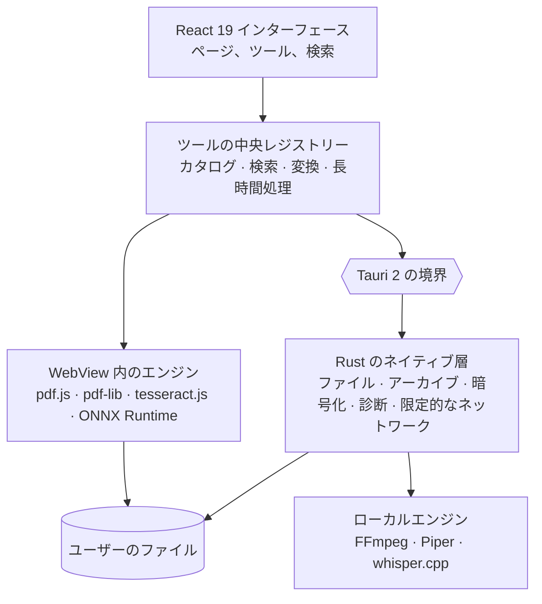

<div align="center">

[English](README.md) · [Français](README.fr.md) · [Español](README.es.md) · [Português (Brasil)](README.pt-BR.md) · [Deutsch](README.de.md) · [Italiano](README.it.md) · [简体中文](README.zh-CN.md) · **日本語** · [한국어](README.ko.md) · [Русский](README.ru.md)


### 196 のツール。12 のカテゴリー。ひとつのローカル デスクトップアプリ。

PDF、画像、音声、動画、文書、ファイル、開発者ツール、プライバシー保護をひとつにまとめた
デスクトップ用ツールボックスです。196 のツールがひとつのアプリに収まり、ファイルが
コンピューターの外に出ることはありません。

[](docs/guides/INSTALLATION.md#windows-10-and-11)
[](docs/guides/INSTALLATION.md#other-linux-distributions)
[](docs/technical/ARCHITECTURE.md)
[](docs/technical/ARCHITECTURE.md)
[](docs/technical/ARCHITECTURE.md)
[](docs/legal/PRIVACY.md)
[][releases]

**[ダウンロード][releases]** · **[ドキュメント](docs/README.md)** ·
**[すべてのツール](docs/guides/FEATURES.md)** · **[プライバシー](docs/legal/PRIVACY.md)**

</div>

<br>

<div align="center">

<sub>自然な言葉での検索、カタログ、PDF の結合、画像のリアルタイム調整、JSON — 実際のインターフェースをそのまま録画し、1.3 倍速にしたものです。</sub>
</div>

## FourTout でできること

<table>
<tr>
<td width="33%" valign="top">

**PDF と文書**<br>
結合、分割、圧縮、墨消し、スキャンの OCR、検索可能な PDF、表の抽出、Word から PDF への変換。

</td>
<td width="33%" valign="top">

**画像**<br>
変換、圧縮、切り抜き、**背景の削除**、テキストの抽出、EXIF の消去、ファビコンの生成。

</td>
<td width="33%" valign="top">

**音声と動画**<br>
変換、圧縮、カット、正規化、文字起こし、音声合成、字幕、動画 ↔ GIF。

</td>
</tr>
<tr>
<td valign="top">

**ファイルとアーカイブ**<br>
ZIP、7z、TAR、AES-256 暗号化アーカイブ、ハッシュ、重複ファイル、一括リネーム、フォルダーのバックアップ。

</td>
<td valign="top">

**開発者向け**<br>
JSON、YAML、TOML、XML、SQL、検証付き JWT、正規表現、cron、QR コード、読み取り専用の SQLite エクスプローラー。

</td>
<td valign="top">

**診断とセキュリティ**<br>
破損したファイルやアーカイブ、ディスクの健康状態、ファイルの暗号化、パスワード、メタデータ。

</td>
</tr>
</table>

12 カテゴリーの一覧表は[下のほう](#機能)にあります。ツールごとの一覧は
**[docs/guides/FEATURES.md](docs/guides/FEATURES.md)** をご覧ください。

## 言語

インターフェースは **16 の言語** に対応しており、すべてアプリに組み込まれています：
English、Français、Español、Deutsch、Italiano、Português (Brasil)、Nederlands、
Polski、Русский、Türkçe、Bahasa Indonesia、हिन्दी、日本語、한국어、简体中文、繁體中文。
FourTout は既定でシステムの言語に従います。**設定 → 言語** で切り替えるとすぐに反映され、
何もダウンロードしません。

検索はこれらすべての言語を理解します。「pdf を圧縮」「compress a pdf」「compresser un pdf」
「comprimir un pdf」「pdf komprimieren」「сжать pdf」「压缩 pdf」のどれでも同じツールにたどり着き、
形式名（PDF、PNG、MP4、JSON、SHA-256…）はどの言語でも使えます。

## プレビュー

実際のアプリの画面（GitHub の設定に応じてライトまたはダークテーマ）で、ダミーのファイルを使って
撮影しています。画面はフランス語のインターフェースです。

<table>
<tr>
<td width="50%">
<picture>
  <source media="(prefers-color-scheme: dark)" srcset="docs/assets/screenshots/accueil-dark.webp">
  
</picture>
<p align="center"><sub><b>ホーム</b> — お気に入り、最近使用、カテゴリー</sub></p>
</td>
<td width="50%">
<picture>
  <source media="(prefers-color-scheme: dark)" srcset="docs/assets/screenshots/recherche-dark.webp">
  
</picture>
<p align="center"><sub><b>検索</b> — ツール名ではなく、やりたいことを入力</sub></p>
</td>
</tr>
<tr>
<td>
<picture>
  <source media="(prefers-color-scheme: dark)" srcset="docs/assets/screenshots/pdf-dark.webp">
  
</picture>
<p align="center"><sub><b>PDF</b> — 好きな順番で結合</sub></p>
</td>
<td>
<picture>
  <source media="(prefers-color-scheme: dark)" srcset="docs/assets/screenshots/images-dark.webp">
  
</picture>
<p align="center"><sub><b>画像</b> — リアルタイムのプレビューで調整</sub></p>
</td>
</tr>
<tr>
<td>
<picture>
  <source media="(prefers-color-scheme: dark)" srcset="docs/assets/screenshots/fichiers-dark.webp">
  
</picture>
<p align="center"><sub><b>ファイル</b> — Rust で計算する SHA-256 と SHA-512</sub></p>
</td>
<td>
<picture>
  <source media="(prefers-color-scheme: dark)" srcset="docs/assets/screenshots/media-dark.webp">
  
</picture>
<p align="center"><sub><b>メディア</b> — FFmpeg が読み取ったファイルの本当の中身</sub></p>
</td>
</tr>
<tr>
<td>
<picture>
  <source media="(prefers-color-scheme: dark)" srcset="docs/assets/screenshots/developpeur-dark.webp">
  
</picture>
<p align="center"><sub><b>開発者向け</b> — 整形・検証済みの JSON</sub></p>
</td>
<td>
<picture>
  <source media="(prefers-color-scheme: dark)" srcset="docs/assets/screenshots/diagnostic-dark.webp">
  
</picture>
<p align="center"><sub><b>診断</b> — 壊れたアーカイブのどこが壊れているか</sub></p>
</td>
</tr>
</table>

## なぜ FourTout なのか

PDF を圧縮する、画像を WebP に変換する、動画から音声を取り出す、JSON を整形する、キロメートルを
マイルに換算する、写真の被写体を切り抜く——どれも 30 秒で終わる作業です。ところが道具を探すほうが
時間がかかり、それを提供する無料サイトの多くはファイルのアップロードを求めます。

FourTout の出発点はその逆です。**コンピューターの上でできる処理は、そこで行う。**

製品を支えるのは 3 つの原則です。

1. **カタログにあるものは動く。** 「近日公開」のツールはありません。未完成のツールは登録されません。
2. **検証できない約束はしない。** ツールに限界があるとき——物理的ではない消去、ピクセル単位で忠実では
   ない Word 変換、デコードしただけで検証していない JWT——インターフェースは、ユーザーが必要とする
   場所でそれを伝えます。
3. **何もでっち上げない。** 検索は実在するツールだけを提案し、通貨換算は出所のわからないレートではなく
   レートの日付を表示します。

## 機能

| カテゴリー | ツール数 | 例 |
| --- | ---: | --- |
| **PDF** | 26 | 結合、分割、圧縮、墨消し、OCR、忘れたパスワードの回復 |
| **画像** | 25 | 変換、圧縮、切り抜き、透かし、OCR、**背景の削除**、EXIF の消去 |
| **オーディオ** | 18 | 変換、正規化、無音のカット、音声合成、文字起こし |
| **動画** | 20 | 変換、圧縮、切り抜き、字幕付け、字幕の焼き込み、動画 ↔ GIF |
| **テキストと文書** | 20 | 整形、比較、Markdown ↔ HTML、DOCX の読み取りと変換 |
| **ファイルとアーカイブ** | 29 | アーカイブ、ハッシュ、重複、一括リネーム、バックアップ、16 進エディター |
| **変換ツール** | 1 | ファイルをドロップすると、FourTout が可能な変換を提案 |
| **開発者向け** | 21 | JSON、XML、YAML、TOML、SQL、Base32、**検証付き** JWT、**SQLite データベース**、正規表現、cron |
| **計算ツール** | 21 | 単位、パーセント、日付、**タイムゾーン**、**帯域幅**、**利息**、通貨 |
| **ネットワーク** | 3 | Ping、ポート確認、ローカルネットワークの検出——範囲を限定し、それを越えない |
| **診断と復旧** | 5 | 壊れたファイル、読めないアーカイブ、壊れた PDF、破損した画像、ディスクとパーティション |
| **セキュリティ** | 7 | パスワード、ファイルの暗号化、HMAC、メタデータの削除 |

各ツールは所属するカテゴリーで数えています：合計 196 です。ツールは、探されそうな別のカテゴリーにも
表示されることがあるため、アプリではカテゴリーごとの数がこれより多くなります。

ツールごとの完全な一覧：**[docs/guides/FEATURES.md](docs/guides/FEATURES.md)**。

## プライバシー

ファイルの処理はすべてローカルで行われます：PDF、画像、音声、動画、テキスト、アーカイブ、ハッシュ、
暗号化、背景の切り抜き。ファイルがアップロードされることはありません。アカウントも、アクセス解析も、
テレメトリーも、自動更新もありません。

例外は 2 つの機能だけで、どちらもインターフェースにその旨が表示されます。

- **通貨換算** は欧州中央銀行が毎日公表する参照レートを取得します。換算する金額がコンピューターの外に
  出ることはありません。オフラインのときは最後に取得したレートを使い、**その日付を表示します**。
- 音声合成、文字起こし、背景の切り抜きの **モデル** は、あなたが明示的に求めたときに一度だけ
  ダウンロードされます。その後はすべてコンピューター上で動作します。

3 つの **ネットワーク** ツール（ping、ポート、ローカルネットワークの検出）は実際に接続しますが、
接続先はあなたが指定したホストかローカルのサブネットだけで、クリックなしに動くことはありません。

機能ごとの詳細：**[docs/legal/PRIVACY.md](docs/legal/PRIVACY.md)**。

## インストール

**[Releases][releases]** ページからお使いのシステム用のパッケージをダウンロードしてください。

| システム | ファイル |
| --- | --- |
| Windows 10 / 11 | `FourTout-<version>-Windows-x64-Setup.exe` |
| Fedora、RHEL | `FourTout-<version>-Fedora-x86_64.rpm` |
| Debian、Ubuntu | `FourTout-<version>-Linux-amd64.deb` |
| その他の Linux | `FourTout-<version>-Linux-x86_64.AppImage` |

> **「Code → Download ZIP」は使わないでください。** そのアーカイブに入っているのはソースコードで、
> アプリではありません。インストール用のファイルは Releases ページにあります。

詳しい手順、必要な環境、ハッシュの確認方法：**[docs/guides/INSTALLATION.md](docs/guides/INSTALLATION.md)**。

> Windows 用インストーラーはまだ署名されていないため、初回起動時に SmartScreen の警告が表示されます。
> これは想定どおりで、インストールガイドで説明しています。

## アーキテクチャ



| 層 | 技術 |
| --- | --- |
| インターフェース | React 19、TypeScript、Tailwind CSS 4、Vite 7 |
| デスクトップアプリ | Tauri 2（Linux では WebKitGTK、Windows では WebView2） |
| ネイティブ処理 | Rust — ファイル、アーカイブ、暗号化、ハッシュ、サイドカー |
| PDF | pdf.js（読み取り、描画）、@cantoo/pdf-lib（書き込み） |
| メディア | FFmpeg（システム版または同梱版）、コーデックは実行時に確認 |
| OCR | tesseract.js、完全にローカル |
| 背景の切り抜き | ONNX Runtime 上の U²-Net、完全にローカル |
| 音声 | Piper（合成）、whisper.cpp（文字起こし） |
| 言語 | 16 言語を内蔵、ICU 形式のメッセージ、`Intl` による書式設定 |

すべてのツールは **中央レジストリー** から派生しています。カタログ、ナビゲーション、検索、万能変換、
ドラッグ＆ドロップの振り分けは、どれも同じ情報源を読みます。翻訳はその隣に、ツール ID ごとに
置かれているため、ツールが言語ごとに重複することはありません。詳細：
**[docs/technical/ARCHITECTURE.md](docs/technical/ARCHITECTURE.md)** と
**[docs/technical/I18N.md](docs/technical/I18N.md)**。

## 開発

```bash
pnpm install       # Node の依存関係
pnpm app:dev       # デスクトップアプリを起動（Tauri + Vite）
pnpm verify        # lint + 型チェック + テスト + ビルド
pnpm i18n:status   # 言語ごとの翻訳状況
```

必要な環境、規約、環境まわりの落とし穴：**[docs/technical/DEVELOPMENT.md](docs/technical/DEVELOPMENT.md)**。
パッケージのビルド：**[docs/technical/BUILD.md](docs/technical/BUILD.md)**。
スクリーンショット、バナー、デモの再生成：**[scripts/showcase/README.md](scripts/showcase/README.md)**。

## セキュリティ

ファイルの暗号化では、鍵の導出に **Argon2id** を、暗号化に **XChaCha20-Poly1305** を使い、
認証付きのブロック単位で処理します。保護されたアーカイブは **WinZip AES-256** を使い、7-Zip、
WinRAR、Windows エクスプローラーで開けます。

脅威モデル、暗号化ファイルの形式、完全削除の限界、脆弱性の報告方法：
**[docs/legal/SECURITY.md](docs/legal/SECURITY.md)**。

## ドキュメント

英語版の総合目次は **[docs/README.md](docs/README.md)**、完全なフランス語版は
**[docs/fr/](docs/fr/README.md)** にあります。

## ライセンス

**FourTout はプロプライエタリ ソフトウェアです。**
Copyright © 2026 Matheo Dolmen. All rights reserved.

ソースコードは、読み、監査し、議論できるように GitHub で公開しています。公開によって再利用や
再配布のライセンスが付与されることはありません。実質的な複製、再配布、改変版の公開、商用利用には、
事前の書面による許可が必要です。

**[LICENSE](LICENSE)** をご覧ください。

## サードパーティのコンポーネント

FourTout はフリーソフトウェアを利用しており、それらは **それぞれのライセンス** に従います——
FourTout のライセンスがそれに取って代わることはありません。一覧：
**[THIRD_PARTY_NOTICES.md](THIRD_PARTY_NOTICES.md)**。

[releases]: https://github.com/lolmath06/FourTout/releases
