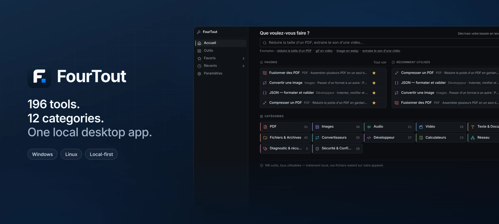
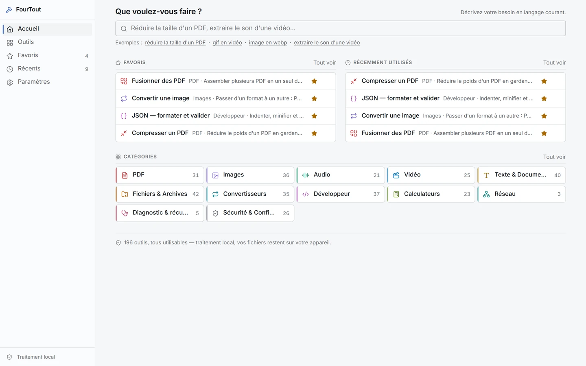
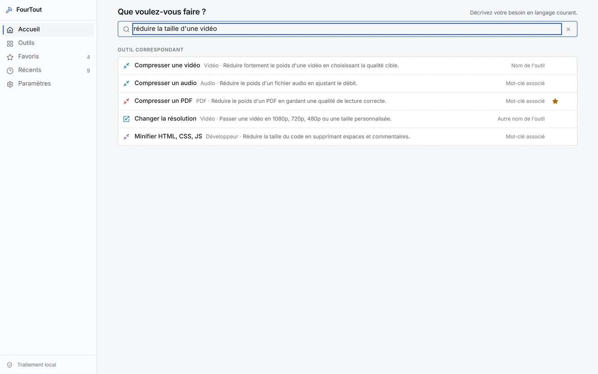
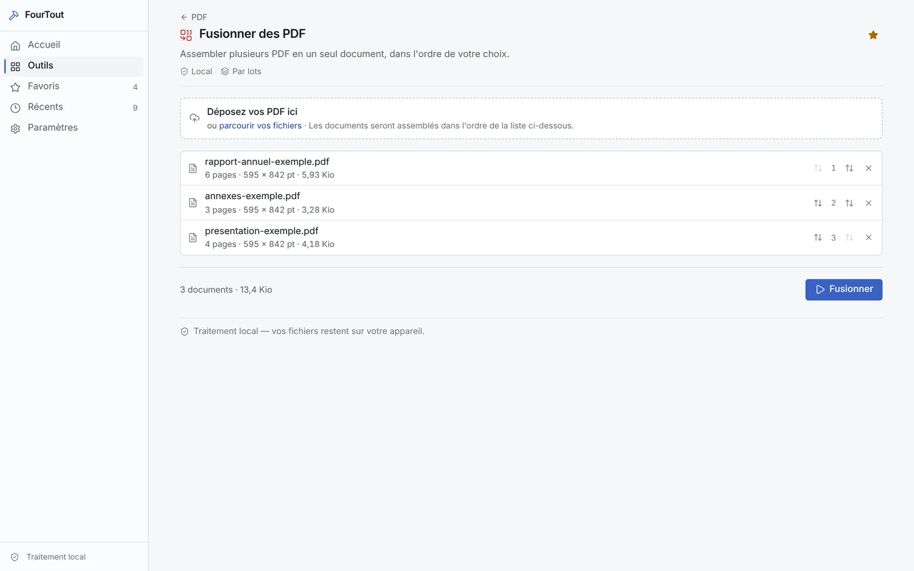
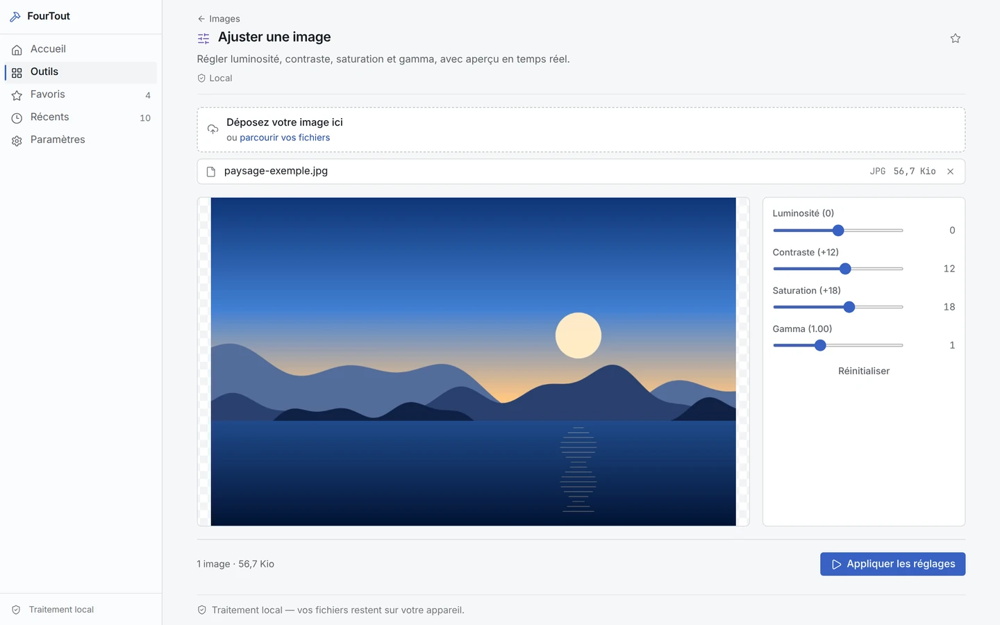
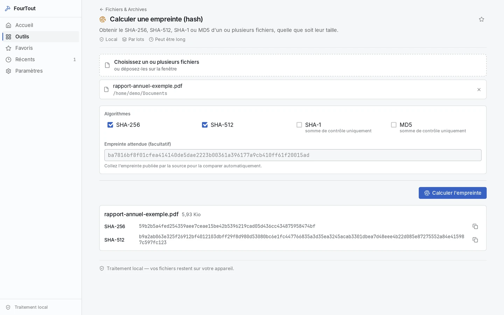
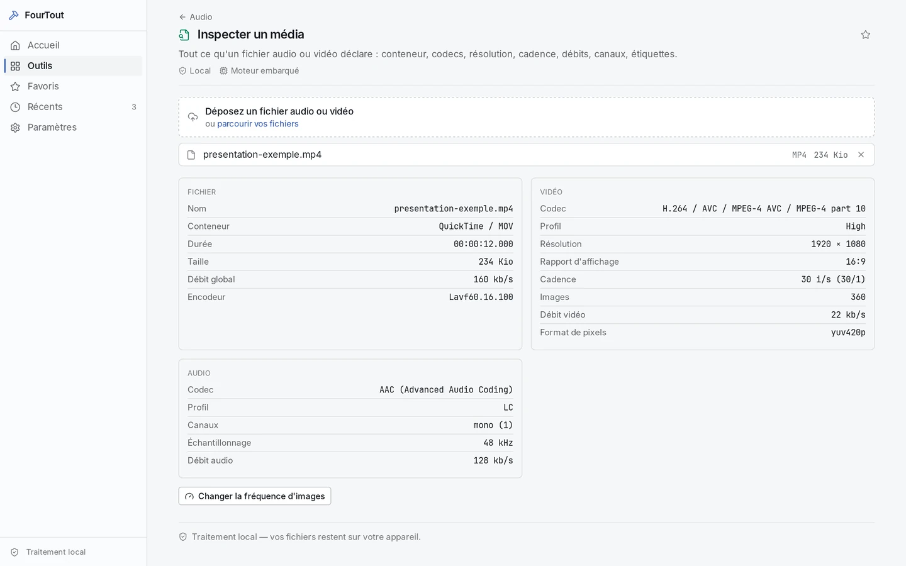
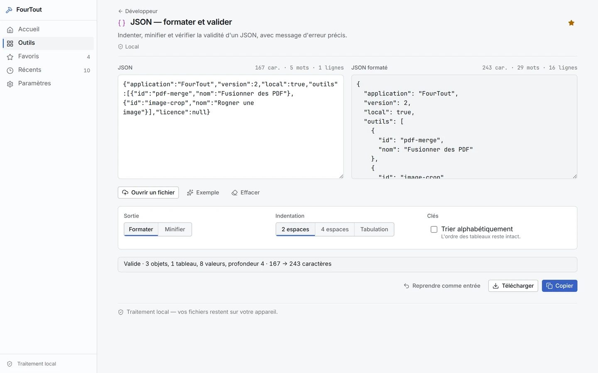
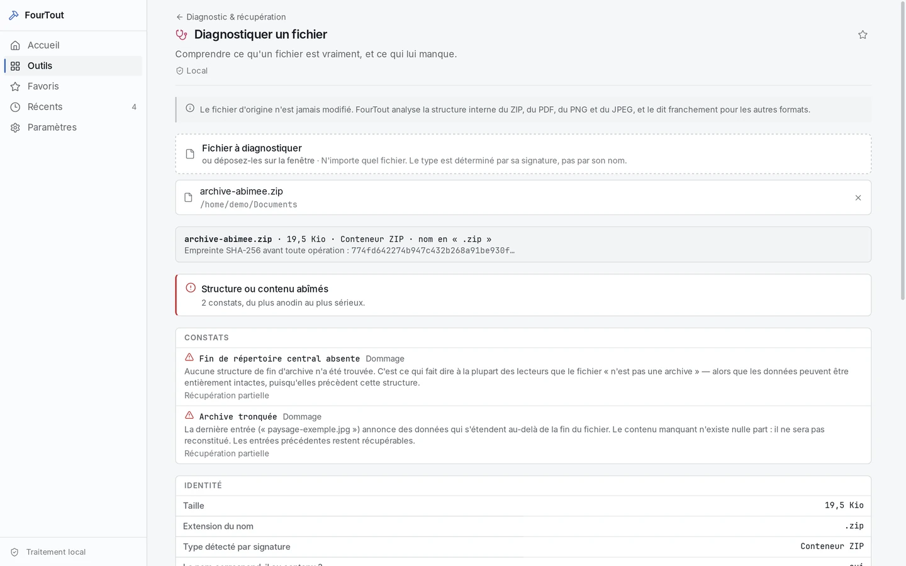
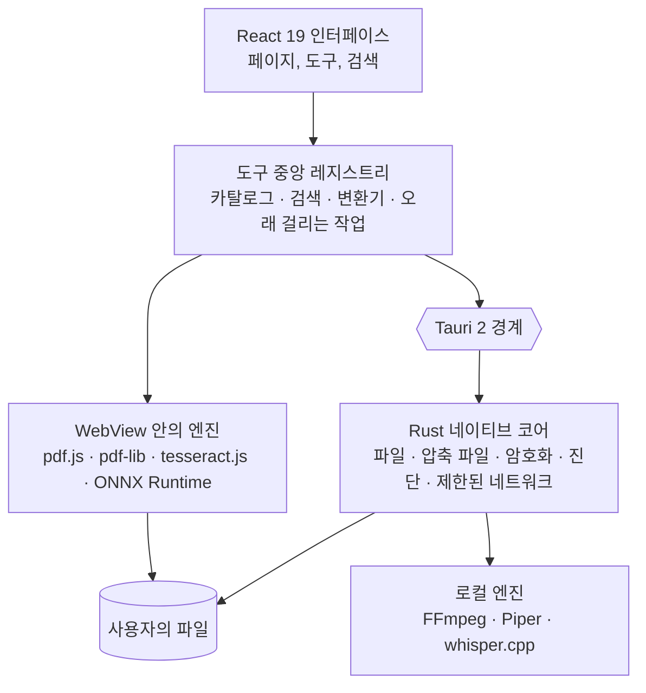

<div align="center">

[English](README.md) · [Français](README.fr.md) · [Español](README.es.md) · [Português (Brasil)](README.pt-BR.md) · [Deutsch](README.de.md) · [Italiano](README.it.md) · [简体中文](README.zh-CN.md) · [日本語](README.ja.md) · **한국어** · [Русский](README.ru.md)



### 196개 도구. 12개 카테고리. 하나의 로컬 데스크톱 앱.

PDF, 이미지, 오디오, 동영상, 문서, 파일, 개발자 도구, 개인정보 보호를 한데 모은 데스크톱
도구 상자입니다. 196개 도구가 하나의 앱에 들어 있고, 파일은 컴퓨터 밖으로 나가지 않습니다.

[](docs/guides/INSTALLATION.md#windows-10-et-11)
[](docs/guides/INSTALLATION.md#autres-distributions-linux)
[](docs/technical/ARCHITECTURE.md)
[](docs/technical/ARCHITECTURE.md)
[](docs/technical/ARCHITECTURE.md)
[](docs/legal/PRIVACY.md)
[][releases]

**[다운로드][releases]** · **[문서](docs/README.md)** ·
**[모든 도구](docs/guides/FEATURES.md)** · **[개인정보](docs/legal/PRIVACY.md)**

</div>

<br>

<div align="center">

<sub>자연어 검색, 카탈로그, PDF 병합, 실시간 이미지 보정, JSON — 실제 인터페이스를 그대로 녹화해 1.3배속으로 재생했습니다.</sub>
</div>

## FourTout로 할 수 있는 일

<table>
<tr>
<td width="33%" valign="top">

**PDF와 문서**<br>
병합, 분할, 압축, 가리기, 스캔본 OCR, 검색 가능한 PDF, 표 추출, Word를 PDF로.

</td>
<td width="33%" valign="top">

**이미지**<br>
변환, 압축, 자르기, **배경 제거**, 텍스트 추출, EXIF 삭제, 파비콘 생성.

</td>
<td width="33%" valign="top">

**오디오와 동영상**<br>
변환, 압축, 자르기, 정규화, 받아쓰기, 음성 합성, 자막, 동영상 ↔ GIF.

</td>
</tr>
<tr>
<td valign="top">

**파일과 압축 파일**<br>
ZIP, 7z, TAR, AES-256 암호화 압축 파일, 해시, 중복 파일, 일괄 이름 바꾸기, 폴더 백업.

</td>
<td valign="top">

**개발자**<br>
JSON, YAML, TOML, XML, SQL, 검증되는 JWT, 정규식, cron, QR 코드, 읽기 전용 SQLite 탐색기.

</td>
<td valign="top">

**진단과 보안**<br>
손상된 파일과 압축 파일, 디스크 상태, 파일 암호화, 비밀번호, 메타데이터.

</td>
</tr>
</table>

12개 카테고리 전체 표는 [아래](#기능)에 있습니다. 도구별 목록은
**[docs/guides/FEATURES.md](docs/guides/FEATURES.md)**에서 볼 수 있습니다.

## 언어

인터페이스는 **16개 언어**를 지원하며, 모두 앱에 포함되어 있습니다: English, Français,
Español, Deutsch, Italiano, Português (Brasil), Nederlands, Polski, Русский, Türkçe,
Bahasa Indonesia, हिन्दी, 日本語, 한국어, 简体中文, 繁體中文. FourTout는 기본적으로
시스템 언어를 따르며, **설정 → 언어**에서 바꾸면 즉시 적용됩니다 — 아무것도 다운로드하지 않습니다.

검색은 이 모든 언어를 이해합니다. “pdf 압축”, “compress a pdf”, “compresser un pdf”,
“comprimir un pdf”, “pdf komprimieren”, “сжать pdf”, “pdf を圧縮”, “压缩 pdf” 모두 같은 도구로
이어지며, 형식 이름(PDF, PNG, MP4, JSON, SHA-256…)은 어떤 언어에서든 통합니다.

## 미리 보기

실제 앱 화면(GitHub 설정에 따라 라이트 또는 다크 테마)이며, 가상의 파일로 만들었습니다.
화면은 프랑스어 인터페이스입니다.

<table>
<tr>
<td width="50%">
<picture>
  <source media="(prefers-color-scheme: dark)" srcset="docs/assets/screenshots/accueil-dark.webp">
  
</picture>
<p align="center"><sub><b>홈</b> — 즐겨찾기, 최근 항목, 카테고리</sub></p>
</td>
<td width="50%">
<picture>
  <source media="(prefers-color-scheme: dark)" srcset="docs/assets/screenshots/recherche-dark.webp">
  
</picture>
<p align="center"><sub><b>검색</b> — 도구 이름이 아니라 하고 싶은 일을 입력</sub></p>
</td>
</tr>
<tr>
<td>
<picture>
  <source media="(prefers-color-scheme: dark)" srcset="docs/assets/screenshots/pdf-dark.webp">
  
</picture>
<p align="center"><sub><b>PDF</b> — 원하는 순서대로 병합</sub></p>
</td>
<td>
<picture>
  <source media="(prefers-color-scheme: dark)" srcset="docs/assets/screenshots/images-dark.webp">
  
</picture>
<p align="center"><sub><b>이미지</b> — 실시간 미리 보기로 보정</sub></p>
</td>
</tr>
<tr>
<td>
<picture>
  <source media="(prefers-color-scheme: dark)" srcset="docs/assets/screenshots/fichiers-dark.webp">
  
</picture>
<p align="center"><sub><b>파일</b> — Rust로 계산하는 SHA-256과 SHA-512</sub></p>
</td>
<td>
<picture>
  <source media="(prefers-color-scheme: dark)" srcset="docs/assets/screenshots/media-dark.webp">
  
</picture>
<p align="center"><sub><b>미디어</b> — FFmpeg가 읽은 파일의 실제 내용</sub></p>
</td>
</tr>
<tr>
<td>
<picture>
  <source media="(prefers-color-scheme: dark)" srcset="docs/assets/screenshots/developpeur-dark.webp">
  
</picture>
<p align="center"><sub><b>개발자</b> — 정렬하고 검증한 JSON</sub></p>
</td>
<td>
<picture>
  <source media="(prefers-color-scheme: dark)" srcset="docs/assets/screenshots/diagnostic-dark.webp">
  
</picture>
<p align="center"><sub><b>진단</b> — 손상된 압축 파일의 어디가 망가졌는지</sub></p>
</td>
</tr>
</table>

## 왜 FourTout인가

PDF 압축, 이미지를 WebP로 변환, 동영상에서 소리 추출, JSON 정렬, 킬로미터를 마일로 환산, 사진 누끼
따기 — 모두 30초면 끝나는 일입니다. 그런데 도구를 찾는 데는 더 오래 걸리고, 그 기능을 제공하는 무료
사이트는 대개 파일 업로드를 요구합니다.

FourTout는 반대에서 출발합니다. **컴퓨터에서 할 수 있는 작업이라면, 컴퓨터에서 합니다.**

세 가지 원칙이 제품을 지탱합니다.

1. **카탈로그에 있는 것은 작동합니다.** “출시 예정” 도구는 없습니다. 완성되지 않은 도구는 등록하지
   않습니다.
2. **확인할 수 없는 약속은 하지 않습니다.** 도구에 한계가 있을 때 — 물리적이지 않은 삭제, 픽셀 단위로
   똑같지 않은 Word 변환, 디코딩만 하고 검증하지 않은 JWT — 인터페이스는 사용자가 필요한 바로 그곳에서
   알려 줍니다.
3. **아무것도 지어내지 않습니다.** 검색은 실제로 있는 도구만 제안하고, 환율 변환기는 출처를 알 수 없는
   환율 대신 환율의 날짜를 보여 줍니다.

## 기능

| 카테고리 | 도구 수 | 예시 |
| --- | ---: | --- |
| **PDF** | 26 | 병합, 분할, 압축, 가리기, OCR, 잊어버린 비밀번호 복구 |
| **이미지** | 25 | 변환, 압축, 자르기, 워터마크, OCR, **배경 제거**, EXIF 삭제 |
| **오디오** | 18 | 변환, 정규화, 무음 자르기, 음성 합성, 받아쓰기 |
| **동영상** | 20 | 변환, 압축, 자르기, 자막 넣기, 자막 입히기, 동영상 ↔ GIF |
| **텍스트 및 문서** | 20 | 정리, 비교, Markdown ↔ HTML, DOCX 읽기와 변환 |
| **파일 및 압축 파일** | 29 | 압축 파일, 해시, 중복, 일괄 이름 바꾸기, 백업, 16진수 편집기 |
| **변환기** | 1 | 파일을 놓으면 FourTout가 가능한 변환을 제안 |
| **개발자** | 21 | JSON, XML, YAML, TOML, SQL, Base32, **검증되는** JWT, **SQLite 데이터베이스**, 정규식, cron |
| **계산기** | 21 | 단위, 퍼센트, 날짜, **시간대**, **대역폭**, **이자**, 환율 |
| **네트워크** | 3 | 핑, 포트 테스트, 로컬 네트워크 검색 — 범위를 정해 두고 절대 넘지 않음 |
| **진단 및 복구** | 5 | 손상된 파일, 읽을 수 없는 압축 파일, 깨진 PDF, 손상된 이미지, 디스크와 파티션 |
| **보안** | 7 | 비밀번호, 파일 암호화, HMAC, 메타데이터 제거 |

각 도구는 소속 카테고리에서만 셉니다: 모두 196개입니다. 도구는 사람들이 찾을 만한 다른 카테고리에도
나올 수 있어서, 앱에서는 카테고리별 숫자가 더 크게 표시됩니다.

도구별 전체 목록: **[docs/guides/FEATURES.md](docs/guides/FEATURES.md)**.

## 개인정보

모든 파일 처리는 로컬에서 이루어집니다: PDF, 이미지, 오디오, 동영상, 텍스트, 압축 파일, 해시, 암호화,
배경 제거. 어떤 파일도 업로드하지 않습니다. 계정도, 분석도, 원격 측정도, 자동 업데이트도 없습니다.

예외는 두 가지 기능뿐이며, 둘 다 인터페이스에 그 사실을 표시합니다.

- **환율 변환기**는 유럽중앙은행이 매일 발표하는 기준 환율을 조회합니다. 변환할 금액은 컴퓨터 밖으로
  나가지 않으며, 오프라인일 때는 마지막으로 받은 환율을 **날짜와 함께** 다시 사용합니다.
- 음성 합성, 받아쓰기, 배경 제거 **모델**은 명시적으로 요청할 때 한 번만 다운로드합니다. 그 뒤로는 모두
  컴퓨터에서 실행됩니다.

세 가지 **네트워크** 도구(핑, 포트, 로컬 네트워크 검색)는 실제로 연결을 열지만, 지정한 호스트나 로컬
서브넷에만 연결하며 클릭 없이는 동작하지 않습니다.

기능별 자세한 내용: **[docs/legal/PRIVACY.md](docs/legal/PRIVACY.md)**.

## 설치

**[Releases][releases]** 페이지에서 사용 중인 시스템용 패키지를 내려받으세요.

| 시스템 | 파일 |
| --- | --- |
| Windows 10 / 11 | `FourTout-<version>-Windows-x64-Setup.exe` |
| Fedora, RHEL | `FourTout-<version>-Fedora-x86_64.rpm` |
| Debian, Ubuntu | `FourTout-<version>-Linux-amd64.deb` |
| 기타 Linux | `FourTout-<version>-Linux-x86_64.AppImage` |

> **“Code → Download ZIP”은 사용하지 마세요.** 그 압축 파일에는 앱이 아니라 소스 코드가 들어 있습니다.
> 설치 파일은 Releases 페이지에 있습니다.

자세한 설치 방법, 필요 조건, 해시 확인: **[docs/guides/INSTALLATION.md](docs/guides/INSTALLATION.md)**.

> Windows 설치 프로그램은 아직 서명되지 않아 첫 실행 때 SmartScreen 경고가 나타납니다. 예상된 동작이며
> 설치 가이드에 설명되어 있습니다.

## 아키텍처



| 계층 | 기술 |
| --- | --- |
| 인터페이스 | React 19, TypeScript, Tailwind CSS 4, Vite 7 |
| 데스크톱 앱 | Tauri 2 (Linux는 WebKitGTK, Windows는 WebView2) |
| 네이티브 처리 | Rust — 파일, 압축 파일, 암호화, 해시, 사이드카 |
| PDF | pdf.js(읽기, 렌더링), @cantoo/pdf-lib(쓰기) |
| 미디어 | FFmpeg(시스템 또는 동봉), 실행 시 코덱 확인 |
| OCR | tesseract.js, 완전히 로컬 |
| 배경 제거 | ONNX Runtime 기반 U²-Net, 완전히 로컬 |
| 음성 | Piper(합성), whisper.cpp(받아쓰기) |
| 언어 | 16개 언어 내장, ICU 형식 메시지, `Intl` 서식 |

모든 도구는 **중앙 레지스트리**에서 나옵니다. 카탈로그, 탐색, 검색, 만능 변환기, 끌어서 놓기 분배가 모두
같은 원본을 읽습니다. 번역은 그 옆에 도구 ID별로 놓여 있어, 도구가 언어마다 중복되지 않습니다. 자세히:
**[docs/technical/ARCHITECTURE.md](docs/technical/ARCHITECTURE.md)** 및
**[docs/technical/I18N.md](docs/technical/I18N.md)**.

## 개발

```bash
pnpm install       # Node 의존성
pnpm app:dev       # 데스크톱 앱 실행 (Tauri + Vite)
pnpm verify        # lint + 타입 검사 + 테스트 + 빌드
pnpm i18n:status   # 언어별 번역 현황
```

필요 조건, 규칙, 환경 관련 함정: **[docs/technical/DEVELOPMENT.md](docs/technical/DEVELOPMENT.md)**.
패키지 빌드: **[docs/technical/BUILD.md](docs/technical/BUILD.md)**.
스크린샷, 배너, 데모 다시 만들기: **[scripts/showcase/README.md](scripts/showcase/README.md)**.

## 보안

파일 암호화는 키 유도에 **Argon2id**를, 암호화에 **XChaCha20-Poly1305**를 사용하며 인증된 블록 단위로
처리합니다. 보호된 압축 파일은 **WinZip AES-256**을 사용하며 7-Zip, WinRAR, Windows 탐색기에서 열립니다.

위협 모델, 암호화 파일 형식, 안전한 삭제의 한계, 취약점 신고 방법:
**[docs/legal/SECURITY.md](docs/legal/SECURITY.md)**.

## 문서

전체 목차: **[docs/README.md](docs/README.md)**. 문서는 프랑스어로 작성되어 있습니다.

## 라이선스

**FourTout는 독점 소프트웨어입니다.**
Copyright © 2026 Matheo Dolmen. All rights reserved.

소스 코드는 읽고, 감사하고, 논의할 수 있도록 GitHub에 공개되어 있습니다. 공개했다고 해서 재사용이나
재배포 라이선스가 주어지지는 않습니다. 상당한 분량의 복제, 재배포, 수정본 공개, 상업적 이용에는 사전
서면 허가가 필요합니다.

**[LICENSE](LICENSE)**를 참고하세요.

## 서드파티 구성 요소

FourTout는 자유 소프트웨어를 사용하며, 이들은 **각자의 라이선스**를 따릅니다 — FourTout의 라이선스가
이를 대체하지 않습니다. 전체 목록: **[THIRD_PARTY_NOTICES.md](THIRD_PARTY_NOTICES.md)**.

[releases]: https://github.com/lolmath06/FourTout/releases
