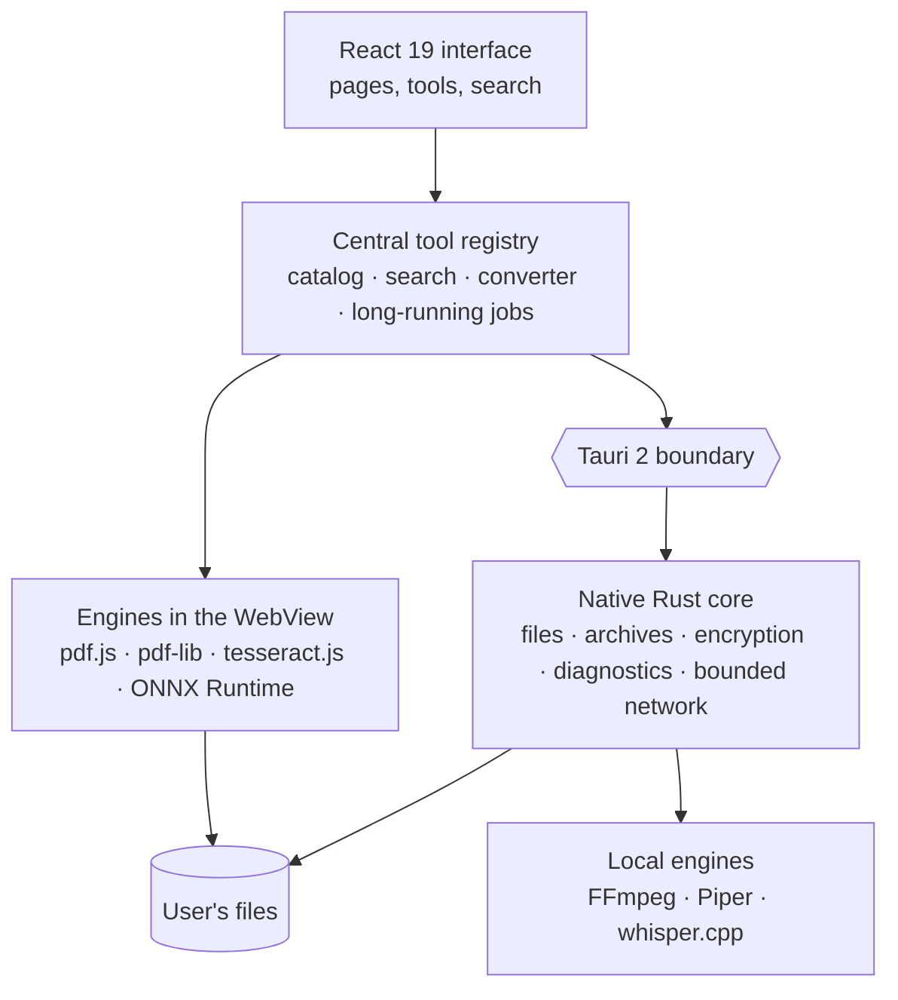

<div align="center">

**English** · [Français](README.fr.md) · [Español](README.es.md) · [Português (Brasil)](README.pt-BR.md) · [Deutsch](README.de.md) · [Italiano](README.it.md) · [简体中文](README.zh-CN.md) · [日本語](README.ja.md) · [한국어](README.ko.md) · [Русский](README.ru.md)


### 196 tools. 12 categories. One local desktop app.

A desktop toolbox that brings together PDF, images, audio, video, documents,
files, developer tools and privacy — 196 tools in a single application, and
your files never leave your machine.

[](docs/guides/INSTALLATION.md#windows-10-and-11)
[](docs/guides/INSTALLATION.md#other-linux-distributions)
[](docs/technical/ARCHITECTURE.md)
[](docs/technical/ARCHITECTURE.md)
[](docs/technical/ARCHITECTURE.md)
[](docs/legal/PRIVACY.md)
[][releases]

**[Download][releases]** · **[Documentation](docs/README.md)** ·
**[All tools](docs/guides/FEATURES.md)** · **[Privacy](docs/legal/PRIVACY.md)**

</div>

<br>

<div align="center">

<sub>Plain-language search, the catalog, merging PDFs, live image adjustments, JSON — the real interface, recorded as is and sped up (×1.3).</sub>
</div>

## What FourTout does

<table>
<tr>
<td width="33%" valign="top">

**PDF & documents**<br>
Merge, split, compress, redact, OCR a scan, make a PDF searchable,
extract tables, Word to PDF.

</td>
<td width="33%" valign="top">

**Images**<br>
Convert, compress, crop, **remove the background**, extract text,
strip EXIF, generate a favicon.

</td>
<td width="33%" valign="top">

**Audio & video**<br>
Convert, compress, trim, normalize, transcribe, text to speech,
subtitles, video ↔ GIF.

</td>
</tr>
<tr>
<td valign="top">

**Files & archives**<br>
ZIP, 7z, TAR, AES-256 encrypted archives, hashes, duplicates, bulk
renaming, folder backups.

</td>
<td valign="top">

**Developer**<br>
JSON, YAML, TOML, XML, SQL, verified JWT, regex, cron, QR codes, a
read-only SQLite explorer.

</td>
<td valign="top">

**Diagnostics & security**<br>
Damaged files and archives, disk health, file encryption,
passwords, metadata.

</td>
</tr>
</table>

The full table of the twelve categories is [further down](#features); the
tool-by-tool list is in **[docs/guides/FEATURES.md](docs/guides/FEATURES.md)**.

## Languages

The interface speaks **16 languages**, all built into the application:
English, Français, Español, Deutsch, Italiano, Português (Brasil), Nederlands,
Polski, Русский, Türkçe, Bahasa Indonesia, हिन्दी, 日本語, 한국어, 简体中文 and
繁體中文. By default FourTout follows your system language; you can switch
in **Settings → Language** and the change is instant — nothing is downloaded.

Search understands every one of them: “compress a pdf”, “comprimir un pdf”,
“pdf komprimieren”, “сжать pdf”, “pdf を圧縮”, “pdf 압축” or “压缩 pdf” all
lead to the same tool, and format names (PDF, PNG, MP4, JSON, SHA-256…) work
whatever the language.

## Preview

Screenshots of the real application (light or dark theme depending on your
GitHub setting), made with dummy files. They show the French interface.

<table>
<tr>
<td width="50%">
<picture>
  <source media="(prefers-color-scheme: dark)" srcset="docs/assets/screenshots/accueil-dark.webp">
  
</picture>
<p align="center"><sub><b>Home</b> — favorites, recents, categories</sub></p>
</td>
<td width="50%">
<picture>
  <source media="(prefers-color-scheme: dark)" srcset="docs/assets/screenshots/recherche-dark.webp">
  
</picture>
<p align="center"><sub><b>Search</b> — describe the need, not the tool's name</sub></p>
</td>
</tr>
<tr>
<td>
<picture>
  <source media="(prefers-color-scheme: dark)" srcset="docs/assets/screenshots/pdf-dark.webp">
  
</picture>
<p align="center"><sub><b>PDF</b> — merging, in the order you choose</sub></p>
</td>
<td>
<picture>
  <source media="(prefers-color-scheme: dark)" srcset="docs/assets/screenshots/images-dark.webp">
  
</picture>
<p align="center"><sub><b>Images</b> — adjustments with a live preview</sub></p>
</td>
</tr>
<tr>
<td>
<picture>
  <source media="(prefers-color-scheme: dark)" srcset="docs/assets/screenshots/fichiers-dark.webp">
  
</picture>
<p align="center"><sub><b>Files</b> — SHA-256 and SHA-512 hashes, computed in Rust</sub></p>
</td>
<td>
<picture>
  <source media="(prefers-color-scheme: dark)" srcset="docs/assets/screenshots/media-dark.webp">
  
</picture>
<p align="center"><sub><b>Media</b> — what the file really contains, read by FFmpeg</sub></p>
</td>
</tr>
<tr>
<td>
<picture>
  <source media="(prefers-color-scheme: dark)" srcset="docs/assets/screenshots/developpeur-dark.webp">
  
</picture>
<p align="center"><sub><b>Developer</b> — JSON formatted and validated</sub></p>
</td>
<td>
<picture>
  <source media="(prefers-color-scheme: dark)" srcset="docs/assets/screenshots/diagnostic-dark.webp">
  
</picture>
<p align="center"><sub><b>Diagnostics</b> — what's broken in a damaged archive</sub></p>
</td>
</tr>
</table>

## Why

Compressing a PDF, converting an image to WebP, pulling the sound out of a
video, formatting JSON, converting kilometers to miles, cutting out a photo:
each of these takes thirty seconds. Finding the right tool takes longer, and
the free website that offers it often wants you to upload the file.

FourTout starts from the opposite idea: **if the job can be done on your
machine, it's done there.**

Three principles hold the product together:

1. **What's in the catalog works.** There is no “coming soon” tool: an
   unfinished tool is simply not registered.
2. **No promise that can't be checked.** When a tool has a limit — an erasure
   that isn't physical, a Word conversion that isn't pixel-perfect, a JWT
   that's decoded but not verified — the interface says so, right where the
   user needs it.
3. **Nothing is made up.** Search only suggests tools that actually exist,
   and the currency converter shows the date of its rates rather than a rate
   of unknown origin.

## Features

| Category | Tools | Examples |
| --- | ---: | --- |
| **PDF** | 26 | Merge, split, compress, redact, OCR, recover a forgotten password |
| **Images** | 25 | Convert, compress, crop, watermark, OCR, **remove the background**, strip EXIF |
| **Audio** | 18 | Convert, normalize, cut silences, text to speech, transcription |
| **Video** | 20 | Convert, compress, crop, subtitle, burn in, video ↔ GIF |
| **Text & Documents** | 20 | Clean up, compare, Markdown ↔ HTML, read and convert a DOCX |
| **Files & Archives** | 29 | Archives, hashes, duplicates, batch renaming, backups, hex editor |
| **Converters** | 1 | Drop a file: FourTout suggests the possible conversions |
| **Developer** | 21 | JSON, XML, YAML, TOML, SQL, Base32, **verified** JWT, **SQLite database**, regex, cron |
| **Calculators** | 21 | Units, percentages, dates, **time zones**, **bandwidth**, **interest**, currencies |
| **Network** | 3 | Ping, port test, local network discovery — bounded, and never beyond |
| **Diagnostics & Recovery** | 5 | Corrupted file, unreadable archive, broken PDF, damaged image, disks and partitions |
| **Security** | 7 | Passwords, file encryption, HMAC, metadata removal |

Each tool is counted in the category that owns it: 196 in total. A tool can
also be offered in other categories, wherever people look for it — which is
why the application shows higher counts per category.

The complete list, tool by tool: **[docs/guides/FEATURES.md](docs/guides/FEATURES.md)**.

## Privacy

All file processing is local: PDF, images, audio, video, text, archives,
hashes, encryption, background removal. No file is ever uploaded. No account,
no analytics, no telemetry, no automatic updates.

Two features are exceptions, and both say so in the interface:

- the **currency converter** queries the European Central Bank's daily
  reference feed. The amount being converted never leaves the machine;
  offline, the last known rates are reused **and dated**;
- the **models** for text to speech, transcription and background removal
  are downloaded once, at your explicit request. After that, everything runs
  on the machine.

The three **network** tools (ping, ports, local network discovery) open real
connections, but only to the hosts you specify or to your local subnet, and
never without a click.

Feature by feature: **[docs/legal/PRIVACY.md](docs/legal/PRIVACY.md)**.

## Installation

Download the package for your system from the **[Releases][releases]** page.

| System | File |
| --- | --- |
| Windows 10 / 11 | `FourTout-<version>-Windows-x64-Setup.exe` |
| Fedora, RHEL | `FourTout-<version>-Fedora-x86_64.rpm` |
| Debian, Ubuntu | `FourTout-<version>-Linux-amd64.deb` |
| Other Linux | `FourTout-<version>-Linux-x86_64.AppImage` |

> **Don't use “Code → Download ZIP”.** That archive contains the source code,
> not the application. The installable files are on the Releases page.

Detailed instructions, prerequisites and hash verification:
**[docs/guides/INSTALLATION.md](docs/guides/INSTALLATION.md)**.

> The Windows installers aren't signed yet: SmartScreen will show a warning on
> first launch. That's expected, and explained in the installation guide.

## Architecture


```mermaid
flowchart TB
  UI["React 19 interface<br/>pages, tools, search"]
  REG["Central tool registry<br/>catalog · search · converter · long-running jobs"]
  WEB["Engines in the WebView<br/>pdf.js · pdf-lib · tesseract.js · ONNX Runtime"]
  IPC{{"Tauri 2 boundary"}}
  RUST["Native Rust core<br/>files · archives · encryption · diagnostics · bounded network"]
  SIDE["Local engines<br/>FFmpeg · Piper · whisper.cpp"]
  FS[("User's files")]

  UI --> REG
  REG --> WEB
  REG --> IPC --> RUST
  RUST --> SIDE
  WEB --> FS
  RUST --> FS
```

| Layer | Technology |
| --- | --- |
| Interface | React 19, TypeScript, Tailwind CSS 4, Vite 7 |
| Desktop application | Tauri 2 (WebKitGTK on Linux, WebView2 on Windows) |
| Native processing | Rust — files, archives, encryption, hashes, sidecars |
| PDF | pdf.js (reading, rendering), @cantoo/pdf-lib (writing) |
| Media | FFmpeg (system or bundled), codecs probed at runtime |
| OCR | tesseract.js, entirely local |
| Background removal | U²-Net via ONNX Runtime, entirely local |
| Speech | Piper (synthesis), whisper.cpp (transcription) |
| Languages | 16 built-in locales, ICU-style messages, `Intl` formatting |

Every tool derives from a **central registry**: catalog, navigation, search,
the universal converter and drag-and-drop routing all read the same source.
Translations sit next to it, keyed by tool id, so a tool is never duplicated
per language. Details: **[docs/technical/ARCHITECTURE.md](docs/technical/ARCHITECTURE.md)**
and **[docs/technical/I18N.md](docs/technical/I18N.md)**.

## Development

```bash
pnpm install       # Node dependencies
pnpm app:dev       # launch the desktop application (Tauri + Vite)
pnpm verify        # lint + typecheck + tests + build
pnpm i18n:status   # translation coverage, language by language
```

Prerequisites, conventions and environment pitfalls:
**[docs/technical/DEVELOPMENT.md](docs/technical/DEVELOPMENT.md)**.
Building the packages: **[docs/technical/BUILD.md](docs/technical/BUILD.md)**.
Regenerating the screenshots, banner and demo:
**[scripts/showcase/README.md](scripts/showcase/README.md)**.

## Security

File encryption uses **Argon2id** to derive the key and
**XChaCha20-Poly1305** to encrypt, in authenticated chunks. Protected archives
use **WinZip AES-256**, readable by 7-Zip, WinRAR and Windows Explorer.

Threat model, encrypted file format, the limits of secure deletion and how to
report a vulnerability:
**[docs/legal/SECURITY.md](docs/legal/SECURITY.md)**.

## Documentation

The full English index is **[docs/README.md](docs/README.md)**, with a complete
French mirror under **[docs/fr/](docs/fr/README.md)**.

## License

**FourTout is proprietary software.**
Copyright © 2026 Matheo Dolmen. All rights reserved.

The source code is published on GitHub to be read, audited and discussed: its
publication grants no license to reuse or redistribute it. Any substantial
copy, redistribution, published modified version or commercial use requires
prior written permission.

See **[LICENSE](LICENSE)**.

## Third-party components

FourTout builds on free software, which remains under **its own licenses** —
FourTout's license does not replace them. Full inventory:
**[THIRD_PARTY_NOTICES.md](THIRD_PARTY_NOTICES.md)**.

[releases]: https://github.com/lolmath06/FourTout/releases
