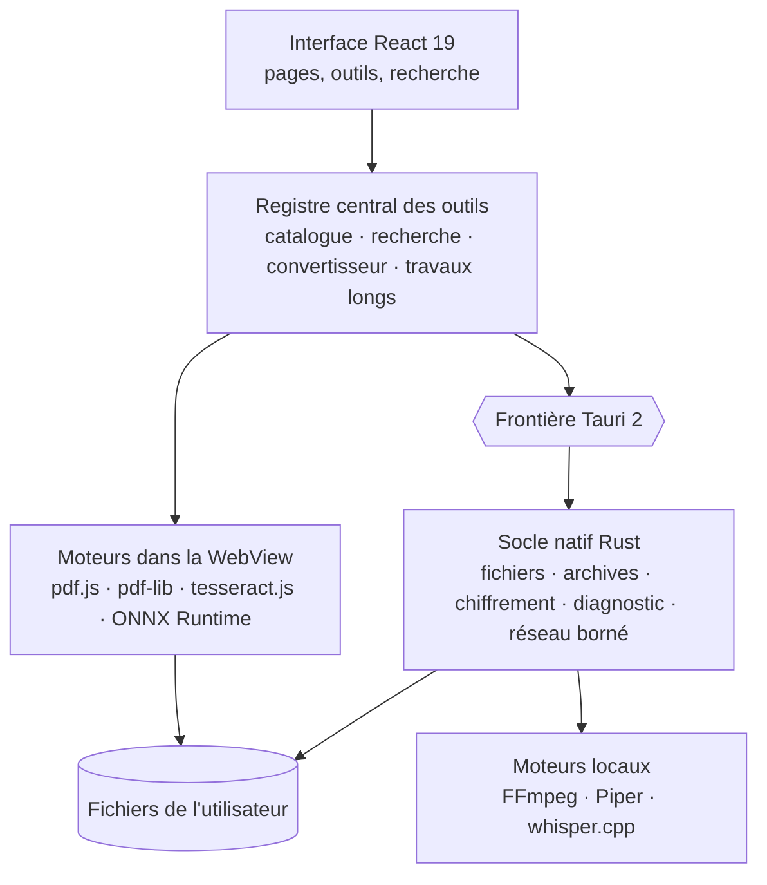

<div align="center">


### 196 tools. 12 categories. One local desktop app.

Une boîte à outils desktop qui regroupe PDF, images, audio, vidéo, documents,
fichiers, outils développeur et confidentialité — 196 outils, une seule
application, et vos fichiers ne quittent pas votre machine.

[](docs/guides/INSTALLATION.md#windows-10-et-11)
[](docs/guides/INSTALLATION.md#autres-distributions-linux)
[](docs/technical/ARCHITECTURE.md)
[](docs/technical/ARCHITECTURE.md)
[](docs/technical/ARCHITECTURE.md)
[](docs/legal/PRIVACY.md)
[][releases]

**[Télécharger][releases]** · **[Documentation](docs/README.md)** ·
**[Tous les outils](docs/guides/FEATURES.md)** · **[Confidentialité](docs/legal/PRIVACY.md)**

</div>

<br>

<div align="center">

<sub>Recherche en langage courant, catalogue, fusion de PDF, réglages d'image en temps réel, JSON — l'interface réelle, enregistrée telle quelle puis accélérée (×1,3).</sub>
</div>

## Ce que fait FourTout

<table>
<tr>
<td width="33%" valign="top">

**PDF & documents**<br>
Fusionner, séparer, compresser, caviarder, OCR d'un scan, PDF recherchable,
tableaux extraits, Word vers PDF.

</td>
<td width="33%" valign="top">

**Images**<br>
Convertir, compresser, rogner, **retirer l'arrière-plan**, extraire le texte,
effacer l'EXIF, générer un favicon.

</td>
<td width="33%" valign="top">

**Audio & vidéo**<br>
Convertir, compresser, découper, normaliser, transcrire, synthèse vocale,
sous-titres, vidéo ↔ GIF.

</td>
</tr>
<tr>
<td valign="top">

**Fichiers & archives**<br>
ZIP, 7z, TAR, archives chiffrées AES-256, empreintes, doublons, renommage en
masse, sauvegarde de dossiers.

</td>
<td valign="top">

**Développeur**<br>
JSON, YAML, TOML, XML, SQL, JWT vérifié, regex, cron, QR codes, explorateur
SQLite en lecture seule.

</td>
<td valign="top">

**Diagnostic & sécurité**<br>
Fichiers et archives abîmés, santé des disques, chiffrement de fichiers,
mots de passe, métadonnées.

</td>
</tr>
</table>

Le tableau complet des douze catégories est [plus bas](#fonctionnalités) ;
la liste outil par outil est dans **[docs/guides/FEATURES.md](docs/guides/FEATURES.md)**.

## Aperçu

Captures de l'application réelle (thème clair ou sombre selon votre réglage
GitHub), réalisées avec des fichiers fictifs.

<table>
<tr>
<td width="50%">
<picture>
  <source media="(prefers-color-scheme: dark)" srcset="docs/assets/screenshots/accueil-dark.webp">
  
</picture>
<p align="center"><sub><b>Accueil</b> — favoris, récents, catégories</sub></p>
</td>
<td width="50%">
<picture>
  <source media="(prefers-color-scheme: dark)" srcset="docs/assets/screenshots/recherche-dark.webp">
  
</picture>
<p align="center"><sub><b>Recherche</b> — décrivez le besoin, pas le nom de l'outil</sub></p>
</td>
</tr>
<tr>
<td>
<picture>
  <source media="(prefers-color-scheme: dark)" srcset="docs/assets/screenshots/pdf-dark.webp">
  
</picture>
<p align="center"><sub><b>PDF</b> — fusion, dans l'ordre choisi</sub></p>
</td>
<td>
<picture>
  <source media="(prefers-color-scheme: dark)" srcset="docs/assets/screenshots/images-dark.webp">
  
</picture>
<p align="center"><sub><b>Images</b> — réglages avec aperçu en temps réel</sub></p>
</td>
</tr>
<tr>
<td>
<picture>
  <source media="(prefers-color-scheme: dark)" srcset="docs/assets/screenshots/fichiers-dark.webp">
  
</picture>
<p align="center"><sub><b>Fichiers</b> — empreintes SHA-256 et SHA-512, calculées en Rust</sub></p>
</td>
<td>
<picture>
  <source media="(prefers-color-scheme: dark)" srcset="docs/assets/screenshots/media-dark.webp">
  
</picture>
<p align="center"><sub><b>Média</b> — ce que le fichier contient vraiment, lu par FFmpeg</sub></p>
</td>
</tr>
<tr>
<td>
<picture>
  <source media="(prefers-color-scheme: dark)" srcset="docs/assets/screenshots/developpeur-dark.webp">
  
</picture>
<p align="center"><sub><b>Développeur</b> — JSON formaté et validé</sub></p>
</td>
<td>
<picture>
  <source media="(prefers-color-scheme: dark)" srcset="docs/assets/screenshots/diagnostic-dark.webp">
  
</picture>
<p align="center"><sub><b>Diagnostic</b> — ce qu'une archive abîmée a de cassé</sub></p>
</td>
</tr>
</table>

## Pourquoi

Compresser un PDF, convertir une image en WebP, extraire le son d'une vidéo,
formater du JSON, convertir des kilomètres en miles, détourer une photo :
chacune de ces tâches prend trente secondes. Les trouver prend plus longtemps,
et le site gratuit qui les propose demande souvent de téléverser le fichier.

FourTout part de l'idée inverse : **si l'opération peut se faire sur votre
machine, elle s'y fait.**

Trois principes tiennent le produit :

1. **Ce qui est au catalogue fonctionne.** Il n'y a pas d'outil « bientôt
   disponible » : un outil incomplet n'est pas enregistré.
2. **Aucune promesse invérifiable.** Quand un outil a une limite — un
   effacement qui n'est pas physique, une conversion Word qui n'est pas fidèle
   au pixel, un JWT décodé mais pas vérifié — l'interface le dit, là où
   l'utilisateur en a besoin.
3. **Rien n'est inventé.** La recherche ne propose que des outils réellement
   présents, et le convertisseur de devises affiche la date du relevé plutôt
   qu'un taux d'origine inconnue.

## Fonctionnalités

| Catégorie | Outils | Exemples |
| --- | ---: | --- |
| **PDF** | 26 | Fusionner, séparer, compresser, caviarder, OCR, retrouver un mot de passe oublié |
| **Images** | 25 | Convertir, compresser, rogner, filigrane, OCR, **retirer l'arrière-plan**, effacer l'EXIF |
| **Audio** | 18 | Convertir, normaliser, couper les silences, synthèse vocale, transcription |
| **Vidéo** | 20 | Convertir, compresser, rogner, sous-titrer, incruster, vidéo ↔ GIF |
| **Texte & Documents** | 20 | Nettoyer, comparer, Markdown ↔ HTML, lire et convertir un DOCX |
| **Fichiers & Archives** | 29 | Archives, empreintes, doublons, renommage par lot, sauvegarde, éditeur hexadécimal |
| **Convertisseurs** | 1 | Déposez un fichier : FourTout propose les conversions possibles |
| **Développeur** | 21 | JSON, XML, YAML, TOML, SQL, Base32, JWT **vérifié**, **base SQLite**, regex, cron |
| **Calculateurs** | 21 | Unités, pourcentages, dates, **fuseaux horaires**, **débits**, **intérêts**, devises |
| **Réseau** | 3 | Ping, test de ports, découverte du réseau local — bornés, et jamais au-delà |
| **Diagnostic & récupération** | 5 | Fichier corrompu, archive illisible, PDF cassé, image abîmée, disques et partitions |
| **Sécurité** | 7 | Mots de passe, chiffrement de fichiers, HMAC, suppression des métadonnées |

Chaque outil est compté dans sa catégorie propriétaire : 196 au total. Un
outil peut aussi être proposé dans d'autres catégories, là où on le cherche —
c'est pourquoi l'application affiche des nombres plus élevés par catégorie.

La liste complète, outil par outil : **[docs/guides/FEATURES.md](docs/guides/FEATURES.md)**.

## Confidentialité

Tout le traitement de fichiers est local : PDF, images, audio, vidéo, texte,
archives, empreintes, chiffrement, détourage. Aucun fichier n'est téléversé.
Ni compte, ni analytique, ni télémétrie, ni mise à jour automatique.

Deux fonctions font exception, et les deux le disent dans l'interface :

- le **convertisseur de devises** interroge le flux de référence quotidien de
  la Banque centrale européenne. Le montant à convertir ne quitte jamais la
  machine ; hors ligne, le dernier relevé connu est réutilisé **et daté** ;
- les **modèles** de synthèse vocale, de transcription et de détourage sont
  téléchargés une seule fois, à votre demande explicite. Ensuite, tout
  s'exécute sur la machine.

Les trois outils **réseau** (ping, ports, découverte du réseau local) ouvrent
de vraies connexions, mais uniquement vers les hôtes que vous indiquez ou
votre sous-réseau local, et jamais sans un clic.

Le détail, fonction par fonction : **[docs/legal/PRIVACY.md](docs/legal/PRIVACY.md)**.

## Installation

Téléchargez le paquet de votre système depuis la page **[Releases][releases]**.

| Système | Fichier |
| --- | --- |
| Windows 10 / 11 | `FourTout-<version>-Windows-x64-Setup.exe` |
| Fedora, RHEL | `FourTout-<version>-Fedora-x86_64.rpm` |
| Debian, Ubuntu | `FourTout-<version>-Linux-amd64.deb` |
| Autres Linux | `FourTout-<version>-Linux-x86_64.AppImage` |

> **N'utilisez pas « Code → Download ZIP ».** Cette archive contient le code
> source, pas l'application. Les fichiers installables sont sur la page
> Releases.

Instructions détaillées, prérequis et vérification des empreintes :
**[docs/guides/INSTALLATION.md](docs/guides/INSTALLATION.md)**.

> Les installeurs Windows ne sont pas encore signés : SmartScreen affichera un
> avertissement au premier lancement. C'est attendu, et expliqué dans le guide
> d'installation.

## Architecture


```mermaid
flowchart TB
  UI["Interface React 19<br/>pages, outils, recherche"]
  REG["Registre central des outils<br/>catalogue · recherche · convertisseur · travaux longs"]
  WEB["Moteurs dans la WebView<br/>pdf.js · pdf-lib · tesseract.js · ONNX Runtime"]
  IPC{{"Frontière Tauri 2"}}
  RUST["Socle natif Rust<br/>fichiers · archives · chiffrement · diagnostic · réseau borné"]
  SIDE["Moteurs locaux<br/>FFmpeg · Piper · whisper.cpp"]
  FS[("Fichiers de l'utilisateur")]

  UI --> REG
  REG --> WEB
  REG --> IPC --> RUST
  RUST --> SIDE
  WEB --> FS
  RUST --> FS
```

| Couche | Technologie |
| --- | --- |
| Interface | React 19, TypeScript, Tailwind CSS 4, Vite 7 |
| Application desktop | Tauri 2 (WebKitGTK sur Linux, WebView2 sur Windows) |
| Traitements natifs | Rust — fichiers, archives, chiffrement, empreintes, sidecars |
| PDF | pdf.js (lecture, rendu), @cantoo/pdf-lib (écriture) |
| Média | FFmpeg (système ou embarqué), codecs éprouvés à l'exécution |
| OCR | tesseract.js, entièrement local |
| Détourage | U²-Net via ONNX Runtime, entièrement local |
| Parole | Piper (synthèse), whisper.cpp (transcription) |

Tous les outils dérivent d'un **registre central** : catalogue, navigation,
recherche, convertisseur universel et routage par glisser-déposer lisent la
même source. Détails : **[docs/technical/ARCHITECTURE.md](docs/technical/ARCHITECTURE.md)**.

## Développement

```bash
pnpm install     # dépendances Node
pnpm app:dev     # lance l'application desktop (Tauri + Vite)
pnpm verify      # lint + typecheck + tests + build
```

Prérequis, conventions et pièges d'environnement :
**[docs/technical/DEVELOPMENT.md](docs/technical/DEVELOPMENT.md)**.
Construire les paquets : **[docs/technical/BUILD.md](docs/technical/BUILD.md)**.
Régénérer les captures, la bannière et la démo :
**[scripts/showcase/README.md](scripts/showcase/README.md)**.

## Sécurité

Le chiffrement de fichiers utilise **Argon2id** pour dériver la clé et
**XChaCha20-Poly1305** pour chiffrer, par blocs authentifiés. Les archives
protégées utilisent **WinZip AES-256**, lisible par 7-Zip, WinRAR et
l'Explorateur Windows.

Modèle de menace, format de fichier chiffré, limites de l'effacement sécurisé
et signalement d'une vulnérabilité :
**[docs/legal/SECURITY.md](docs/legal/SECURITY.md)**.

## Documentation

L'index complet : **[docs/README.md](docs/README.md)**.

## Licence

**FourTout est un logiciel propriétaire.**
Copyright © 2026 Matheo Dolmen. Tous droits réservés.

Le code source publié sur GitHub l'est pour être lu, audité et discuté : sa
publication n'emporte aucune licence de réutilisation ou de redistribution.
Toute copie substantielle, redistribution, version modifiée publiée ou
exploitation commerciale requiert une autorisation écrite préalable.

Voir **[LICENSE](LICENSE)**.

## Composants tiers

FourTout s'appuie sur des logiciels libres, qui restent sous **leurs propres
licences** — la licence de FourTout ne s'y substitue pas. Inventaire complet :
**[THIRD_PARTY_NOTICES.md](THIRD_PARTY_NOTICES.md)**.

[releases]: https://github.com/lolmath06/FourTout/releases
