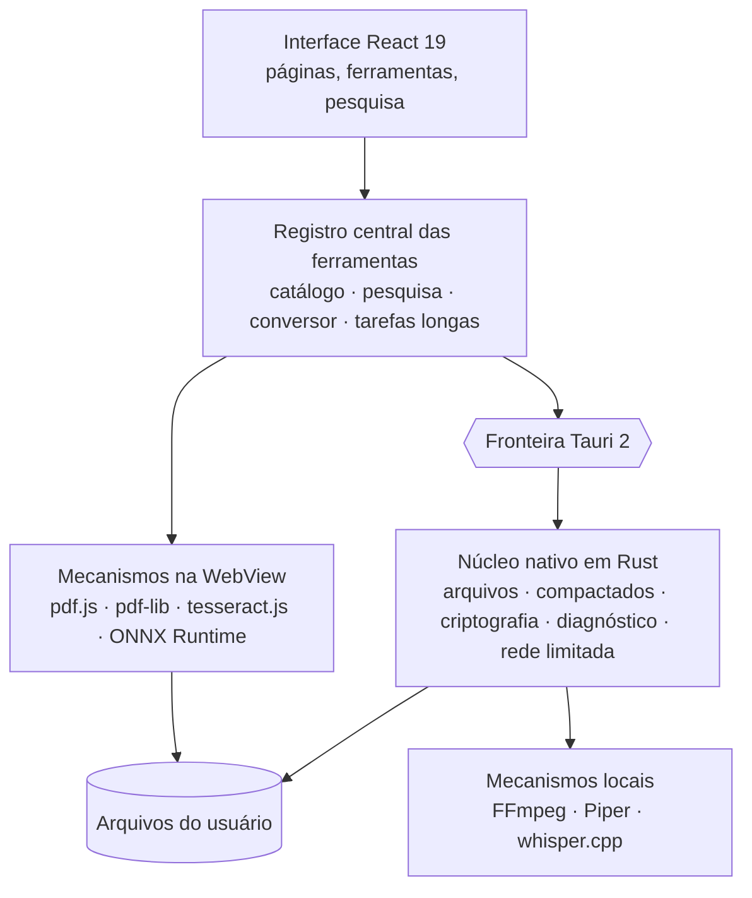

<div align="center">

[English](README.md) · [Français](README.fr.md) · [Español](README.es.md) · **Português (Brasil)** · [Deutsch](README.de.md) · [Italiano](README.it.md) · [简体中文](README.zh-CN.md) · [日本語](README.ja.md) · [한국어](README.ko.md) · [Русский](README.ru.md)


### 196 ferramentas. 12 categorias. Um único aplicativo desktop local.

Uma caixa de ferramentas desktop que reúne PDF, imagens, áudio, vídeo,
documentos, arquivos, ferramentas para desenvolvedores e privacidade — 196
ferramentas em um só aplicativo, e seus arquivos nunca saem do seu computador.

[](docs/guides/INSTALLATION.md#windows-10-et-11)
[](docs/guides/INSTALLATION.md#autres-distributions-linux)
[](docs/technical/ARCHITECTURE.md)
[](docs/technical/ARCHITECTURE.md)
[](docs/technical/ARCHITECTURE.md)
[](docs/legal/PRIVACY.md)
[][releases]

**[Baixar][releases]** · **[Documentação](docs/README.md)** ·
**[Todas as ferramentas](docs/guides/FEATURES.md)** · **[Privacidade](docs/legal/PRIVACY.md)**

</div>

<br>

<div align="center">

<sub>Pesquisa em linguagem natural, catálogo, junção de PDFs, ajustes de imagem em tempo real, JSON — a interface real, gravada como está e acelerada (×1,3).</sub>
</div>

## O que o FourTout faz

<table>
<tr>
<td width="33%" valign="top">

**PDF e documentos**<br>
Juntar, dividir, comprimir, censurar, OCR de digitalizações, PDF pesquisável,
extração de tabelas, Word para PDF.

</td>
<td width="33%" valign="top">

**Imagens**<br>
Converter, comprimir, recortar, **remover o fundo**, extrair texto,
apagar o EXIF, gerar um favicon.

</td>
<td width="33%" valign="top">

**Áudio e vídeo**<br>
Converter, comprimir, cortar, normalizar, transcrever, texto para fala,
legendas, vídeo ↔ GIF.

</td>
</tr>
<tr>
<td valign="top">

**Arquivos e compactados**<br>
ZIP, 7z, TAR, arquivos criptografados AES-256, hashes, duplicatas,
renomeação em massa, backup de pastas.

</td>
<td valign="top">

**Desenvolvedor**<br>
JSON, YAML, TOML, XML, SQL, JWT verificado, regex, cron, QR Codes,
explorador SQLite somente leitura.

</td>
<td valign="top">

**Diagnóstico e segurança**<br>
Arquivos e compactados danificados, saúde dos discos, criptografia de
arquivos, senhas, metadados.

</td>
</tr>
</table>

A tabela completa das doze categorias está [mais abaixo](#recursos); a lista
ferramenta por ferramenta está em **[docs/guides/FEATURES.md](docs/guides/FEATURES.md)**.

## Idiomas

A interface fala **16 idiomas**, todos incluídos no aplicativo:
English, Français, Español, Deutsch, Italiano, Português (Brasil), Nederlands,
Polski, Русский, Türkçe, Bahasa Indonesia, हिन्दी, 日本語, 한국어, 简体中文 e
繁體中文. Por padrão, o FourTout segue o idioma do sistema; você pode trocar em
**Configurações → Idioma**, e a mudança é imediata — nada é baixado.

A pesquisa entende todos eles: “comprimir pdf”, “compress a pdf”,
“compresser un pdf”, “pdf komprimieren”, “сжать pdf”, “pdf を圧縮” ou
“压缩 pdf” levam à mesma ferramenta, e os nomes de formatos (PDF, PNG, MP4,
JSON, SHA-256…) funcionam em qualquer idioma.

## Prévia

Capturas do aplicativo real (tema claro ou escuro conforme sua configuração
do GitHub), feitas com arquivos fictícios. Elas mostram a interface em francês.

<table>
<tr>
<td width="50%">
<picture>
  <source media="(prefers-color-scheme: dark)" srcset="docs/assets/screenshots/accueil-dark.webp">
  
</picture>
<p align="center"><sub><b>Início</b> — favoritos, recentes, categorias</sub></p>
</td>
<td width="50%">
<picture>
  <source media="(prefers-color-scheme: dark)" srcset="docs/assets/screenshots/recherche-dark.webp">
  
</picture>
<p align="center"><sub><b>Pesquisa</b> — descreva a necessidade, não o nome da ferramenta</sub></p>
</td>
</tr>
<tr>
<td>
<picture>
  <source media="(prefers-color-scheme: dark)" srcset="docs/assets/screenshots/pdf-dark.webp">
  
</picture>
<p align="center"><sub><b>PDF</b> — junção, na ordem escolhida</sub></p>
</td>
<td>
<picture>
  <source media="(prefers-color-scheme: dark)" srcset="docs/assets/screenshots/images-dark.webp">
  
</picture>
<p align="center"><sub><b>Imagens</b> — ajustes com prévia em tempo real</sub></p>
</td>
</tr>
<tr>
<td>
<picture>
  <source media="(prefers-color-scheme: dark)" srcset="docs/assets/screenshots/fichiers-dark.webp">
  
</picture>
<p align="center"><sub><b>Arquivos</b> — hashes SHA-256 e SHA-512, calculados em Rust</sub></p>
</td>
<td>
<picture>
  <source media="(prefers-color-scheme: dark)" srcset="docs/assets/screenshots/media-dark.webp">
  
</picture>
<p align="center"><sub><b>Mídia</b> — o que o arquivo realmente contém, lido pelo FFmpeg</sub></p>
</td>
</tr>
<tr>
<td>
<picture>
  <source media="(prefers-color-scheme: dark)" srcset="docs/assets/screenshots/developpeur-dark.webp">
  
</picture>
<p align="center"><sub><b>Desenvolvedor</b> — JSON formatado e validado</sub></p>
</td>
<td>
<picture>
  <source media="(prefers-color-scheme: dark)" srcset="docs/assets/screenshots/diagnostic-dark.webp">
  
</picture>
<p align="center"><sub><b>Diagnóstico</b> — o que está quebrado em um compactado danificado</sub></p>
</td>
</tr>
</table>

## Por quê

Comprimir um PDF, converter uma imagem para WebP, extrair o som de um vídeo,
formatar JSON, converter quilômetros em milhas, recortar uma foto: cada uma
dessas tarefas leva trinta segundos. Encontrar a ferramenta leva mais tempo, e
o site gratuito que a oferece muitas vezes pede que você envie o arquivo.

O FourTout parte da ideia oposta: **se a operação pode ser feita no seu
computador, ela é feita lá.**

Três princípios sustentam o produto:

1. **O que está no catálogo funciona.** Não existe ferramenta “em breve”: uma
   ferramenta incompleta não é registrada.
2. **Nenhuma promessa impossível de verificar.** Quando uma ferramenta tem um
   limite — um apagamento que não é físico, uma conversão de Word que não é
   fiel ao pixel, um JWT decodificado mas não verificado —, a interface avisa,
   bem onde o usuário precisa.
3. **Nada é inventado.** A pesquisa só sugere ferramentas que realmente
   existem, e o conversor de moedas mostra a data das cotações em vez de uma
   taxa de origem desconhecida.

## Recursos

| Categoria | Ferramentas | Exemplos |
| --- | ---: | --- |
| **PDF** | 26 | Juntar, dividir, comprimir, censurar, OCR, recuperar uma senha esquecida |
| **Imagens** | 25 | Converter, comprimir, recortar, marca d'água, OCR, **remover o fundo**, apagar o EXIF |
| **Áudio** | 18 | Converter, normalizar, cortar silêncios, texto para fala, transcrição |
| **Vídeo** | 20 | Converter, comprimir, recortar, legendar, embutir legendas, vídeo ↔ GIF |
| **Texto e documentos** | 20 | Limpar, comparar, Markdown ↔ HTML, ler e converter um DOCX |
| **Arquivos e compactados** | 29 | Compactados, hashes, duplicatas, renomeação em lote, backup, editor hexadecimal |
| **Conversores** | 1 | Solte um arquivo: o FourTout sugere as conversões possíveis |
| **Desenvolvedor** | 21 | JSON, XML, YAML, TOML, SQL, Base32, JWT **verificado**, **banco SQLite**, regex, cron |
| **Calculadoras** | 21 | Unidades, porcentagens, datas, **fusos horários**, **largura de banda**, **juros**, moedas |
| **Rede** | 3 | Ping, teste de portas, descoberta da rede local — limitados, e nunca além disso |
| **Diagnóstico e recuperação** | 5 | Arquivo corrompido, compactado ilegível, PDF quebrado, imagem danificada, discos e partições |
| **Segurança** | 7 | Senhas, criptografia de arquivos, HMAC, remoção de metadados |

Cada ferramenta é contada na categoria a que pertence: 196 no total. Uma
ferramenta também pode aparecer em outras categorias, onde as pessoas a
procuram — por isso o aplicativo mostra números maiores por categoria.

A lista completa, ferramenta por ferramenta: **[docs/guides/FEATURES.md](docs/guides/FEATURES.md)**.

## Privacidade

Todo o processamento de arquivos é local: PDF, imagens, áudio, vídeo, texto,
compactados, hashes, criptografia, remoção de fundo. Nenhum arquivo é enviado.
Sem conta, sem análise de uso, sem telemetria, sem atualização automática.

Dois recursos são exceções, e ambos avisam na interface:

- o **conversor de moedas** consulta o feed de referência diário do Banco
  Central Europeu. O valor a converter nunca sai do computador; offline, as
  últimas cotações conhecidas são reutilizadas **e datadas**;
- os **modelos** de síntese de voz, transcrição e remoção de fundo são baixados
  uma única vez, a seu pedido explícito. Depois, tudo roda no computador.

As três ferramentas de **rede** (ping, portas, descoberta da rede local) abrem
conexões reais, mas apenas com os hosts que você indicar ou com a sua sub-rede
local, e nunca sem um clique.

Os detalhes, recurso por recurso: **[docs/legal/PRIVACY.md](docs/legal/PRIVACY.md)**.

## Instalação

Baixe o pacote do seu sistema na página **[Releases][releases]**.

| Sistema | Arquivo |
| --- | --- |
| Windows 10 / 11 | `FourTout-<version>-Windows-x64-Setup.exe` |
| Fedora, RHEL | `FourTout-<version>-Fedora-x86_64.rpm` |
| Debian, Ubuntu | `FourTout-<version>-Linux-amd64.deb` |
| Outros Linux | `FourTout-<version>-Linux-x86_64.AppImage` |

> **Não use “Code → Download ZIP”.** Esse arquivo contém o código-fonte, não o
> aplicativo. Os arquivos instaláveis estão na página Releases.

Instruções detalhadas, pré-requisitos e verificação de hashes:
**[docs/guides/INSTALLATION.md](docs/guides/INSTALLATION.md)**.

> Os instaladores do Windows ainda não são assinados: o SmartScreen mostrará um
> aviso na primeira execução. Isso é esperado e está explicado no guia de
> instalação.

## Arquitetura



| Camada | Tecnologia |
| --- | --- |
| Interface | React 19, TypeScript, Tailwind CSS 4, Vite 7 |
| Aplicativo desktop | Tauri 2 (WebKitGTK no Linux, WebView2 no Windows) |
| Processamento nativo | Rust — arquivos, compactados, criptografia, hashes, sidecars |
| PDF | pdf.js (leitura, renderização), @cantoo/pdf-lib (escrita) |
| Mídia | FFmpeg (do sistema ou incluído), codecs testados em execução |
| OCR | tesseract.js, totalmente local |
| Remoção de fundo | U²-Net via ONNX Runtime, totalmente local |
| Fala | Piper (síntese), whisper.cpp (transcrição) |
| Idiomas | 16 idiomas incluídos, mensagens no estilo ICU, formatação `Intl` |

Todas as ferramentas derivam de um **registro central**: catálogo, navegação,
pesquisa, conversor universal e roteamento por arrastar e soltar leem a mesma
fonte. As traduções ficam ao lado, indexadas pelo identificador da ferramenta:
uma ferramenta nunca é duplicada por idioma. Detalhes:
**[docs/technical/ARCHITECTURE.md](docs/technical/ARCHITECTURE.md)** e
**[docs/technical/I18N.md](docs/technical/I18N.md)**.

## Desenvolvimento

```bash
pnpm install       # dependências Node
pnpm app:dev       # inicia o aplicativo desktop (Tauri + Vite)
pnpm verify        # lint + typecheck + testes + build
pnpm i18n:status   # cobertura das traduções, idioma por idioma
```

Pré-requisitos, convenções e armadilhas do ambiente:
**[docs/technical/DEVELOPMENT.md](docs/technical/DEVELOPMENT.md)**.
Gerar os pacotes: **[docs/technical/BUILD.md](docs/technical/BUILD.md)**.
Regenerar as capturas, o banner e a demonstração:
**[scripts/showcase/README.md](scripts/showcase/README.md)**.

## Segurança

A criptografia de arquivos usa **Argon2id** para derivar a chave e
**XChaCha20-Poly1305** para criptografar, em blocos autenticados. Os
compactados protegidos usam **WinZip AES-256**, legível pelo 7-Zip, WinRAR e
Explorador de Arquivos do Windows.

Modelo de ameaças, formato do arquivo criptografado, limites da exclusão segura
e como relatar uma vulnerabilidade:
**[docs/legal/SECURITY.md](docs/legal/SECURITY.md)**.

## Documentação

O índice completo: **[docs/README.md](docs/README.md)**. A documentação está
escrita em francês.

## Licença

**O FourTout é um software proprietário.**
Copyright © 2026 Matheo Dolmen. Todos os direitos reservados.

O código-fonte é publicado no GitHub para ser lido, auditado e discutido: sua
publicação não concede nenhuma licença de reutilização ou redistribuição.
Qualquer cópia substancial, redistribuição, versão modificada publicada ou uso
comercial exige autorização prévia por escrito.

Veja **[LICENSE](LICENSE)**.

## Componentes de terceiros

O FourTout usa software livre, que continua sob **suas próprias licenças** — a
licença do FourTout não as substitui. Inventário completo:
**[THIRD_PARTY_NOTICES.md](THIRD_PARTY_NOTICES.md)**.

[releases]: https://github.com/lolmath06/FourTout/releases
