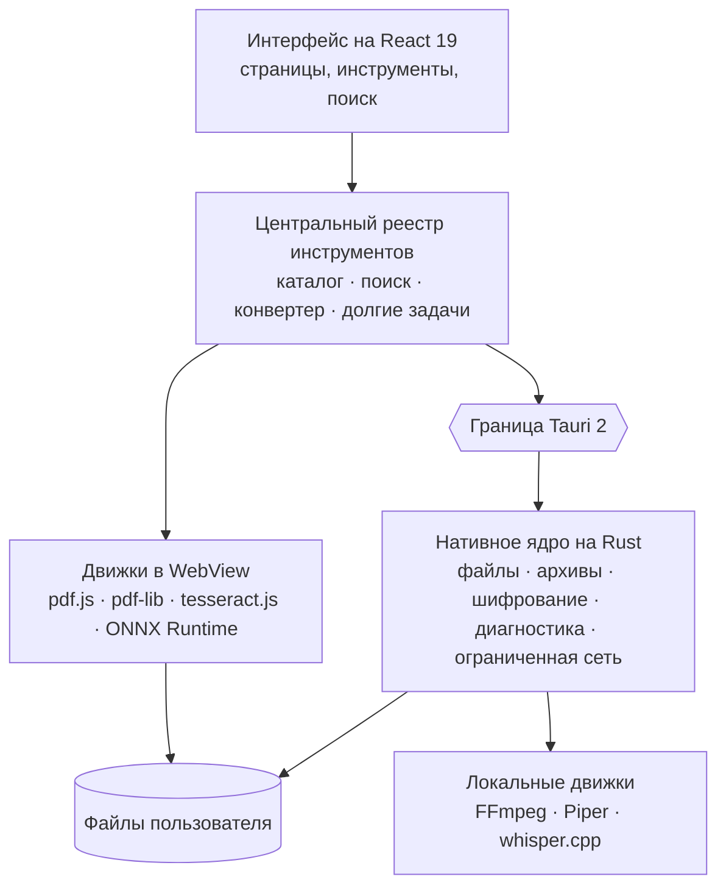

<div align="center">

[English](README.md) · [Français](README.fr.md) · [Español](README.es.md) · [Português (Brasil)](README.pt-BR.md) · [Deutsch](README.de.md) · [Italiano](README.it.md) · [简体中文](README.zh-CN.md) · [日本語](README.ja.md) · [한국어](README.ko.md) · **Русский**


### 196 инструментов. 12 категорий. Одно локальное приложение для компьютера.

Набор инструментов для компьютера, который объединяет PDF, изображения, аудио,
видео, документы, файлы, инструменты разработчика и защиту данных: 196
инструментов в одном приложении, и ваши файлы никогда не покидают компьютер.

[](docs/guides/INSTALLATION.md#windows-10-et-11)
[](docs/guides/INSTALLATION.md#autres-distributions-linux)
[](docs/technical/ARCHITECTURE.md)
[](docs/technical/ARCHITECTURE.md)
[](docs/technical/ARCHITECTURE.md)
[](docs/legal/PRIVACY.md)
[][releases]

**[Скачать][releases]** · **[Документация](docs/README.md)** ·
**[Все инструменты](docs/guides/FEATURES.md)** · **[Конфиденциальность](docs/legal/PRIVACY.md)**

</div>

<br>

<div align="center">

<sub>Поиск обычными словами, каталог, объединение PDF, настройка изображения в реальном времени, JSON — настоящий интерфейс, записанный как есть и ускоренный (×1,3).</sub>
</div>

## Что умеет FourTout

<table>
<tr>
<td width="33%" valign="top">

**PDF и документы**<br>
Объединение, разделение, сжатие, скрытие данных, OCR сканов, PDF с поиском,
извлечение таблиц, Word в PDF.

</td>
<td width="33%" valign="top">

**Изображения**<br>
Конвертация, сжатие, обрезка, **удаление фона**, извлечение текста,
удаление EXIF, создание фавикона.

</td>
<td width="33%" valign="top">

**Аудио и видео**<br>
Конвертация, сжатие, обрезка, нормализация, расшифровка, синтез речи,
субтитры, видео ↔ GIF.

</td>
</tr>
<tr>
<td valign="top">

**Файлы и архивы**<br>
ZIP, 7z, TAR, архивы с шифрованием AES-256, хеши, дубликаты, массовое
переименование, резервные копии папок.

</td>
<td valign="top">

**Разработчику**<br>
JSON, YAML, TOML, XML, SQL, проверка JWT, регулярные выражения, cron,
QR-коды, обозреватель SQLite только для чтения.

</td>
<td valign="top">

**Диагностика и безопасность**<br>
Повреждённые файлы и архивы, состояние дисков, шифрование файлов,
пароли, метаданные.

</td>
</tr>
</table>

Полная таблица двенадцати категорий — [ниже](#возможности); список по
каждому инструменту — в **[docs/guides/FEATURES.md](docs/guides/FEATURES.md)**.

## Языки

Интерфейс говорит на **16 языках**, все они встроены в приложение:
English, Français, Español, Deutsch, Italiano, Português (Brasil), Nederlands,
Polski, Русский, Türkçe, Bahasa Indonesia, हिन्दी, 日本語, 한국어, 简体中文 и
繁體中文. По умолчанию FourTout следует языку системы; сменить его можно в
**Настройки → Язык**, и это происходит мгновенно — ничего не скачивается.

Поиск понимает их все: «сжать pdf», «compress a pdf», «compresser un pdf»,
«comprimir un pdf», «pdf komprimieren», «pdf を圧縮» или «压缩 pdf» ведут к одному
и тому же инструменту, а названия форматов (PDF, PNG, MP4, JSON, SHA-256…)
работают на любом языке.

## Предпросмотр

Снимки настоящего приложения (светлая или тёмная тема — по вашей настройке
GitHub), сделанные на условных файлах. На них — французский интерфейс.

<table>
<tr>
<td width="50%">
<picture>
  <source media="(prefers-color-scheme: dark)" srcset="docs/assets/screenshots/accueil-dark.webp">
  
</picture>
<p align="center"><sub><b>Главная</b> — избранное, недавние, категории</sub></p>
</td>
<td width="50%">
<picture>
  <source media="(prefers-color-scheme: dark)" srcset="docs/assets/screenshots/recherche-dark.webp">
  
</picture>
<p align="center"><sub><b>Поиск</b> — опишите задачу, а не название инструмента</sub></p>
</td>
</tr>
<tr>
<td>
<picture>
  <source media="(prefers-color-scheme: dark)" srcset="docs/assets/screenshots/pdf-dark.webp">
  
</picture>
<p align="center"><sub><b>PDF</b> — объединение в выбранном порядке</sub></p>
</td>
<td>
<picture>
  <source media="(prefers-color-scheme: dark)" srcset="docs/assets/screenshots/images-dark.webp">
  
</picture>
<p align="center"><sub><b>Изображения</b> — настройка с предпросмотром в реальном времени</sub></p>
</td>
</tr>
<tr>
<td>
<picture>
  <source media="(prefers-color-scheme: dark)" srcset="docs/assets/screenshots/fichiers-dark.webp">
  
</picture>
<p align="center"><sub><b>Файлы</b> — хеши SHA-256 и SHA-512, вычисленные на Rust</sub></p>
</td>
<td>
<picture>
  <source media="(prefers-color-scheme: dark)" srcset="docs/assets/screenshots/media-dark.webp">
  
</picture>
<p align="center"><sub><b>Медиа</b> — что файл содержит на самом деле, по данным FFmpeg</sub></p>
</td>
</tr>
<tr>
<td>
<picture>
  <source media="(prefers-color-scheme: dark)" srcset="docs/assets/screenshots/developpeur-dark.webp">
  
</picture>
<p align="center"><sub><b>Разработчику</b> — JSON отформатирован и проверен</sub></p>
</td>
<td>
<picture>
  <source media="(prefers-color-scheme: dark)" srcset="docs/assets/screenshots/diagnostic-dark.webp">
  
</picture>
<p align="center"><sub><b>Диагностика</b> — что сломано в повреждённом архиве</sub></p>
</td>
</tr>
</table>

## Зачем

Сжать PDF, перевести изображение в WebP, вытащить звук из видео,
отформатировать JSON, пересчитать километры в мили, вырезать объект с фото —
каждая из этих задач занимает тридцать секунд. Найти нужный инструмент — дольше,
а бесплатный сайт, который его предлагает, часто просит загрузить файл.

FourTout исходит из обратного: **если операцию можно выполнить на вашем
компьютере, она выполняется там.**

Продукт держится на трёх принципах:

1. **Всё, что есть в каталоге, работает.** Инструментов «скоро будет» нет:
   незавершённый инструмент просто не регистрируется.
2. **Никаких непроверяемых обещаний.** Когда у инструмента есть ограничение —
   удаление, которое не физическое; конвертация Word, которая не точна до
   пикселя; JWT, который декодирован, но не проверен, — интерфейс говорит об
   этом там, где это нужно пользователю.
3. **Ничего не выдумывается.** Поиск предлагает только реально существующие
   инструменты, а конвертер валют показывает дату курсов, а не курс неизвестного
   происхождения.

## Возможности

| Категория | Инструментов | Примеры |
| --- | ---: | --- |
| **PDF** | 26 | Объединение, разделение, сжатие, скрытие данных, OCR, восстановление забытого пароля |
| **Изображения** | 25 | Конвертация, сжатие, обрезка, водяной знак, OCR, **удаление фона**, удаление EXIF |
| **Аудио** | 18 | Конвертация, нормализация, удаление тишины, синтез речи, расшифровка |
| **Видео** | 20 | Конвертация, сжатие, кадрирование, субтитры, вшивание субтитров, видео ↔ GIF |
| **Текст и документы** | 20 | Очистка, сравнение, Markdown ↔ HTML, чтение и конвертация DOCX |
| **Файлы и архивы** | 29 | Архивы, хеши, дубликаты, пакетное переименование, резервные копии, hex-редактор |
| **Конвертеры** | 1 | Перетащите файл — FourTout предложит возможные преобразования |
| **Разработчику** | 21 | JSON, XML, YAML, TOML, SQL, Base32, **проверка** JWT, **база SQLite**, регулярные выражения, cron |
| **Калькуляторы** | 21 | Единицы, проценты, даты, **часовые пояса**, **пропускная способность**, **проценты по вкладу**, валюты |
| **Сеть** | 3 | Пинг, проверка портов, обнаружение устройств в локальной сети — в заданных рамках и никогда за их пределами |
| **Диагностика и восстановление** | 5 | Повреждённый файл, нечитаемый архив, сломанный PDF, испорченное изображение, диски и разделы |
| **Безопасность** | 7 | Пароли, шифрование файлов, HMAC, удаление метаданных |

Каждый инструмент учитывается в своей основной категории: всего 196. Инструмент
может также предлагаться в других категориях, там, где его ищут, — поэтому в
приложении по категориям показаны большие числа.

Полный список по каждому инструменту: **[docs/guides/FEATURES.md](docs/guides/FEATURES.md)**.

## Конфиденциальность

Вся обработка файлов локальная: PDF, изображения, аудио, видео, текст, архивы,
хеши, шифрование, удаление фона. Ни один файл не загружается в сеть. Ни учётной
записи, ни аналитики, ни телеметрии, ни автоматических обновлений.

Исключений два, и оба отмечены в интерфейсе:

- **конвертер валют** запрашивает ежедневные справочные курсы Европейского
  центрального банка. Сумма для пересчёта никогда не покидает компьютер; офлайн
  используются последние известные курсы — **с указанием даты**;
- **модели** синтеза речи, расшифровки и удаления фона скачиваются один раз и
  только по вашему явному запросу. Дальше всё работает на компьютере.

Три **сетевых** инструмента (пинг, порты, обнаружение в локальной сети)
открывают настоящие соединения, но только с указанными вами узлами или с вашей
локальной подсетью — и никогда без нажатия кнопки.

Подробно, функция за функцией: **[docs/legal/PRIVACY.md](docs/legal/PRIVACY.md)**.

## Установка

Скачайте пакет для своей системы на странице **[Releases][releases]**.

| Система | Файл |
| --- | --- |
| Windows 10 / 11 | `FourTout-<version>-Windows-x64-Setup.exe` |
| Fedora, RHEL | `FourTout-<version>-Fedora-x86_64.rpm` |
| Debian, Ubuntu | `FourTout-<version>-Linux-amd64.deb` |
| Другие Linux | `FourTout-<version>-Linux-x86_64.AppImage` |

> **Не используйте «Code → Download ZIP».** В этом архиве исходный код, а не
> приложение. Файлы для установки — на странице Releases.

Подробные инструкции, требования и проверка хешей:
**[docs/guides/INSTALLATION.md](docs/guides/INSTALLATION.md)**.

> Установщики для Windows пока не подписаны: при первом запуске SmartScreen
> покажет предупреждение. Так и должно быть, это объяснено в руководстве по
> установке.

## Архитектура



| Уровень | Технология |
| --- | --- |
| Интерфейс | React 19, TypeScript, Tailwind CSS 4, Vite 7 |
| Настольное приложение | Tauri 2 (WebKitGTK в Linux, WebView2 в Windows) |
| Нативная обработка | Rust — файлы, архивы, шифрование, хеши, sidecar-процессы |
| PDF | pdf.js (чтение, отрисовка), @cantoo/pdf-lib (запись) |
| Медиа | FFmpeg (системный или встроенный), кодеки проверяются при запуске |
| OCR | tesseract.js, полностью локально |
| Удаление фона | U²-Net через ONNX Runtime, полностью локально |
| Речь | Piper (синтез), whisper.cpp (расшифровка) |
| Языки | 16 встроенных языков, сообщения в стиле ICU, форматирование через `Intl` |

Все инструменты происходят из **центрального реестра**: каталог, навигация,
поиск, универсальный конвертер и обработка перетаскивания читают один и тот же
источник. Переводы лежат рядом, по идентификатору инструмента: инструмент
никогда не дублируется для каждого языка. Подробнее:
**[docs/technical/ARCHITECTURE.md](docs/technical/ARCHITECTURE.md)** и
**[docs/technical/I18N.md](docs/technical/I18N.md)**.

## Разработка

```bash
pnpm install       # зависимости Node
pnpm app:dev       # запуск настольного приложения (Tauri + Vite)
pnpm verify        # lint + проверка типов + тесты + сборка
pnpm i18n:status   # покрытие переводов по каждому языку
```

Требования, соглашения и подводные камни окружения:
**[docs/technical/DEVELOPMENT.md](docs/technical/DEVELOPMENT.md)**.
Сборка пакетов: **[docs/technical/BUILD.md](docs/technical/BUILD.md)**.
Как заново создать снимки экрана, баннер и демонстрацию:
**[scripts/showcase/README.md](scripts/showcase/README.md)**.

## Безопасность

Для шифрования файлов используется **Argon2id** для вывода ключа и
**XChaCha20-Poly1305** для шифрования блоками с аутентификацией. Защищённые
архивы используют **WinZip AES-256** и открываются в 7-Zip, WinRAR и Проводнике
Windows.

Модель угроз, формат зашифрованных файлов, ограничения надёжного удаления и как
сообщить об уязвимости: **[docs/legal/SECURITY.md](docs/legal/SECURITY.md)**.

## Документация

Полное оглавление: **[docs/README.md](docs/README.md)**. Документация написана
на французском языке.

## Лицензия

**FourTout — проприетарное программное обеспечение.**
Copyright © 2026 Matheo Dolmen. Все права защищены.

Исходный код опубликован на GitHub, чтобы его можно было читать, проверять и
обсуждать: публикация не даёт никакой лицензии на повторное использование или
распространение. Любое существенное копирование, распространение, публикация
изменённой версии или коммерческое использование требуют предварительного
письменного разрешения.

См. **[LICENSE](LICENSE)**.

## Сторонние компоненты

FourTout опирается на свободное программное обеспечение, которое остаётся под
**своими собственными лицензиями** — лицензия FourTout их не заменяет. Полный
перечень: **[THIRD_PARTY_NOTICES.md](THIRD_PARTY_NOTICES.md)**.

[releases]: https://github.com/lolmath06/FourTout/releases
