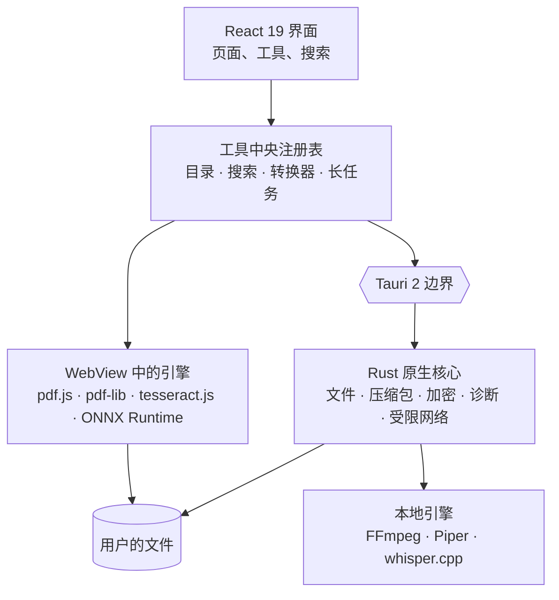

<div align="center">

[English](README.md) · [Français](README.fr.md) · [Español](README.es.md) · [Português (Brasil)](README.pt-BR.md) · [Deutsch](README.de.md) · [Italiano](README.it.md) · **简体中文** · [日本語](README.ja.md) · [한국어](README.ko.md) · [Русский](README.ru.md)


### 196 个工具。12 个分类。一个本地桌面应用。

一个桌面工具箱，把 PDF、图片、音频、视频、文档、文件、开发者工具和隐私工具汇集在一起——
196 个工具、一个应用，而且您的文件始终不会离开您的电脑。

[](docs/guides/INSTALLATION.md#windows-10-and-11)
[](docs/guides/INSTALLATION.md#other-linux-distributions)
[](docs/technical/ARCHITECTURE.md)
[](docs/technical/ARCHITECTURE.md)
[](docs/technical/ARCHITECTURE.md)
[](docs/legal/PRIVACY.md)
[][releases]

**[下载][releases]** · **[文档](docs/README.md)** ·
**[全部工具](docs/guides/FEATURES.md)** · **[隐私](docs/legal/PRIVACY.md)**

</div>

<br>

<div align="center">

<sub>自然语言搜索、工具目录、合并 PDF、实时调整图片、JSON——真实界面，原样录制后加速（×1.3）。</sub>
</div>

## FourTout 能做什么

<table>
<tr>
<td width="33%" valign="top">

**PDF 与文档**<br>
合并、拆分、压缩、涂黑、扫描件 OCR、可搜索 PDF、提取表格、Word 转 PDF。

</td>
<td width="33%" valign="top">

**图片**<br>
转换、压缩、裁剪、**去除背景**、提取文字、清除 EXIF、生成网站图标。

</td>
<td width="33%" valign="top">

**音频与视频**<br>
转换、压缩、剪切、标准化、转写、文字转语音、字幕、视频 ↔ GIF。

</td>
</tr>
<tr>
<td valign="top">

**文件与压缩包**<br>
ZIP、7z、TAR、AES-256 加密压缩包、哈希、重复文件、批量重命名、文件夹备份。

</td>
<td valign="top">

**开发者**<br>
JSON、YAML、TOML、XML、SQL、可验证的 JWT、正则表达式、cron、二维码、只读 SQLite 浏览器。

</td>
<td valign="top">

**诊断与安全**<br>
损坏的文件和压缩包、磁盘健康、文件加密、密码、元数据。

</td>
</tr>
</table>

十二个分类的完整表格见[下文](#功能)；逐个工具的列表见
**[docs/guides/FEATURES.md](docs/guides/FEATURES.md)**。

## 语言

界面支持 **16 种语言**，全部内置于应用中：English、Français、Español、Deutsch、
Italiano、Português (Brasil)、Nederlands、Polski、Русский、Türkçe、
Bahasa Indonesia、हिन्दी、日本語、한국어、简体中文和繁體中文。FourTout 默认跟随系统语言；
您可以在 **设置 → 语言** 中切换，即时生效——无需下载任何内容。

搜索能理解所有这些语言：“压缩 pdf”、“compress a pdf”、“compresser un pdf”、
“comprimir un pdf”、“pdf komprimieren”、“сжать pdf”或“pdf を圧縮”都会找到同一个工具，
格式名称（PDF、PNG、MP4、JSON、SHA-256……）在任何语言下都能使用。

## 预览

真实应用的截图（根据您的 GitHub 设置显示浅色或深色主题），使用虚构文件制作。截图显示的是法语界面。

<table>
<tr>
<td width="50%">
<picture>
  <source media="(prefers-color-scheme: dark)" srcset="docs/assets/screenshots/accueil-dark.webp">
  
</picture>
<p align="center"><sub><b>首页</b> — 收藏、最近使用、分类</sub></p>
</td>
<td width="50%">
<picture>
  <source media="(prefers-color-scheme: dark)" srcset="docs/assets/screenshots/recherche-dark.webp">
  
</picture>
<p align="center"><sub><b>搜索</b> — 描述需求，而不是工具名称</sub></p>
</td>
</tr>
<tr>
<td>
<picture>
  <source media="(prefers-color-scheme: dark)" srcset="docs/assets/screenshots/pdf-dark.webp">
  
</picture>
<p align="center"><sub><b>PDF</b> — 按所选顺序合并</sub></p>
</td>
<td>
<picture>
  <source media="(prefers-color-scheme: dark)" srcset="docs/assets/screenshots/images-dark.webp">
  
</picture>
<p align="center"><sub><b>图片</b> — 带实时预览的调整</sub></p>
</td>
</tr>
<tr>
<td>
<picture>
  <source media="(prefers-color-scheme: dark)" srcset="docs/assets/screenshots/fichiers-dark.webp">
  
</picture>
<p align="center"><sub><b>文件</b> — 用 Rust 计算的 SHA-256 和 SHA-512 哈希</sub></p>
</td>
<td>
<picture>
  <source media="(prefers-color-scheme: dark)" srcset="docs/assets/screenshots/media-dark.webp">
  
</picture>
<p align="center"><sub><b>媒体</b> — 文件真正包含的内容，由 FFmpeg 读取</sub></p>
</td>
</tr>
<tr>
<td>
<picture>
  <source media="(prefers-color-scheme: dark)" srcset="docs/assets/screenshots/developpeur-dark.webp">
  
</picture>
<p align="center"><sub><b>开发者</b> — 格式化并校验后的 JSON</sub></p>
</td>
<td>
<picture>
  <source media="(prefers-color-scheme: dark)" srcset="docs/assets/screenshots/diagnostic-dark.webp">
  
</picture>
<p align="center"><sub><b>诊断</b> — 损坏的压缩包坏在哪里</sub></p>
</td>
</tr>
</table>

## 为什么

压缩一个 PDF、把图片转成 WebP、从视频里提取声音、格式化 JSON、把公里换算成英里、抠出照片里的人物：
每件事都只需要三十秒。找到合适的工具却要更久，而提供这些功能的免费网站往往要求您上传文件。

FourTout 的出发点正好相反：**能在您电脑上完成的操作，就在您电脑上完成。**

三条原则支撑着这个产品：

1. **目录里的工具都能用。** 没有“即将推出”的工具：不完整的工具根本不会被收录。
2. **不做无法验证的承诺。** 当一个工具有局限——不是物理层面的擦除、不是像素级还原的 Word 转换、
   只解码而未验证的 JWT——界面会在用户需要的地方如实说明。
3. **不编造任何东西。** 搜索只推荐真实存在的工具，货币换算器显示汇率的日期，而不是来源不明的汇率。

## 功能

| 分类 | 工具数 | 示例 |
| --- | ---: | --- |
| **PDF** | 26 | 合并、拆分、压缩、涂黑、OCR、找回忘记的密码 |
| **图片** | 25 | 转换、压缩、裁剪、水印、OCR、**去除背景**、清除 EXIF |
| **音频** | 18 | 转换、标准化、剪掉静音、文字转语音、转写 |
| **视频** | 20 | 转换、压缩、裁剪、加字幕、压制字幕、视频 ↔ GIF |
| **文本与文档** | 20 | 清理、比较、Markdown ↔ HTML、读取和转换 DOCX |
| **文件与压缩包** | 29 | 压缩包、哈希、重复文件、批量重命名、备份、十六进制编辑器 |
| **转换器** | 1 | 拖入一个文件：FourTout 会列出可行的转换 |
| **开发者** | 21 | JSON、XML、YAML、TOML、SQL、Base32、**可验证的** JWT、**SQLite 数据库**、正则、cron |
| **计算器** | 21 | 单位、百分比、日期、**时区**、**带宽**、**利息**、货币 |
| **网络** | 3 | Ping、端口测试、局域网发现——有边界，绝不越界 |
| **诊断与恢复** | 5 | 损坏的文件、无法读取的压缩包、损坏的 PDF、损坏的图片、磁盘与分区 |
| **安全** | 7 | 密码、文件加密、HMAC、删除元数据 |

每个工具只计入它所属的分类：共 196 个。一个工具也可能出现在其他分类中，方便人们在常找的地方找到它——
因此应用中各分类显示的数字会更大。

完整列表，逐个工具：**[docs/guides/FEATURES.md](docs/guides/FEATURES.md)**。

## 隐私

所有文件处理都在本地完成：PDF、图片、音频、视频、文本、压缩包、哈希、加密、抠图。不会上传任何文件。
没有账户、没有数据分析、没有遥测、没有自动更新。

只有两项功能例外，而且都会在界面中明确说明：

- **货币换算器** 会查询欧洲中央银行每日发布的参考汇率。要换算的金额绝不会离开电脑；
  离线时会沿用最近一次获取的汇率，**并注明日期**；
- 语音合成、转写和抠图的 **模型** 只会在您明确要求时下载一次。之后一切都在本机运行。

三个 **网络** 工具（ping、端口、局域网发现）会建立真实的连接，但只连接您指定的主机或您的本地子网，
而且必须经过您的点击确认。

逐项说明：**[docs/legal/PRIVACY.md](docs/legal/PRIVACY.md)**。

## 安装

在 **[Releases][releases]** 页面下载适合您系统的安装包。

| 系统 | 文件 |
| --- | --- |
| Windows 10 / 11 | `FourTout-<version>-Windows-x64-Setup.exe` |
| Fedora、RHEL | `FourTout-<version>-Fedora-x86_64.rpm` |
| Debian、Ubuntu | `FourTout-<version>-Linux-amd64.deb` |
| 其他 Linux | `FourTout-<version>-Linux-x86_64.AppImage` |

> **请不要使用“Code → Download ZIP”。** 那个压缩包里是源代码，而不是应用。可安装的文件在 Releases 页面。

详细说明、前提条件和哈希校验：**[docs/guides/INSTALLATION.md](docs/guides/INSTALLATION.md)**。

> Windows 安装程序目前尚未签名：首次启动时 SmartScreen 会显示警告。这是正常现象，安装指南中有说明。

## 架构



| 层 | 技术 |
| --- | --- |
| 界面 | React 19、TypeScript、Tailwind CSS 4、Vite 7 |
| 桌面应用 | Tauri 2（Linux 上为 WebKitGTK，Windows 上为 WebView2） |
| 原生处理 | Rust——文件、压缩包、加密、哈希、sidecar |
| PDF | pdf.js（读取、渲染）、@cantoo/pdf-lib（写入） |
| 媒体 | FFmpeg（系统自带或随附），运行时检测编码器 |
| OCR | tesseract.js，完全本地 |
| 抠图 | 通过 ONNX Runtime 运行 U²-Net，完全本地 |
| 语音 | Piper（合成）、whisper.cpp（转写） |
| 语言 | 16 种内置语言、ICU 风格的消息、`Intl` 格式化 |

所有工具都来自一个 **中央注册表**：目录、导航、搜索、万能转换器和拖放分发都读取同一个来源。
翻译放在旁边，按工具标识索引：同一个工具绝不会按语言重复定义。详情：
**[docs/technical/ARCHITECTURE.md](docs/technical/ARCHITECTURE.md)** 和
**[docs/technical/I18N.md](docs/technical/I18N.md)**。

## 开发

```bash
pnpm install       # Node 依赖
pnpm app:dev       # 启动桌面应用（Tauri + Vite）
pnpm verify        # lint + 类型检查 + 测试 + 构建
pnpm i18n:status   # 各语言的翻译覆盖率
```

前提条件、约定和环境中的常见陷阱：**[docs/technical/DEVELOPMENT.md](docs/technical/DEVELOPMENT.md)**。
构建安装包：**[docs/technical/BUILD.md](docs/technical/BUILD.md)**。
重新生成截图、横幅和演示：**[scripts/showcase/README.md](scripts/showcase/README.md)**。

## 安全

文件加密使用 **Argon2id** 派生密钥，并以经过认证的分块方式使用 **XChaCha20-Poly1305** 加密。
受保护的压缩包使用 **WinZip AES-256**，可用 7-Zip、WinRAR 和 Windows 资源管理器打开。

威胁模型、加密文件格式、安全删除的局限以及如何报告漏洞：
**[docs/legal/SECURITY.md](docs/legal/SECURITY.md)**。

## 文档

完整英文索引见 **[docs/README.md](docs/README.md)**，完整法语镜像见
**[docs/fr/](docs/fr/README.md)**。

## 许可

**FourTout 是专有软件。**
Copyright © 2026 Matheo Dolmen。保留所有权利。

源代码发布在 GitHub 上，供阅读、审计和讨论：发布本身不授予任何复用或再分发的许可。
任何实质性复制、再分发、发布修改版本或商业使用，都需要事先获得书面授权。

参见 **[LICENSE](LICENSE)**。

## 第三方组件

FourTout 依赖自由软件，这些软件仍受 **其各自许可证** 约束——FourTout 的许可证不会取代它们。完整清单：
**[THIRD_PARTY_NOTICES.md](THIRD_PARTY_NOTICES.md)**。

[releases]: https://github.com/lolmath06/FourTout/releases
